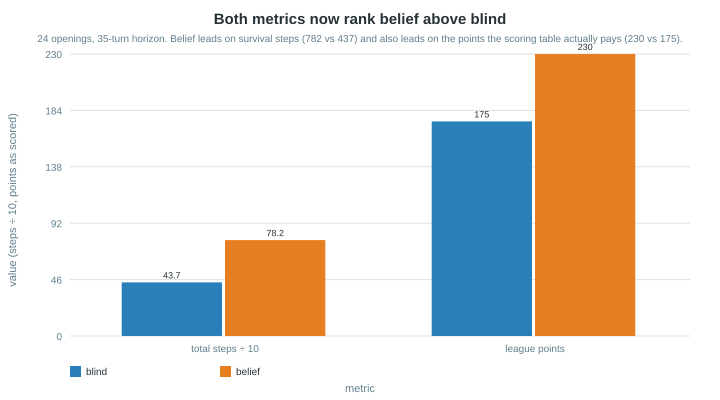
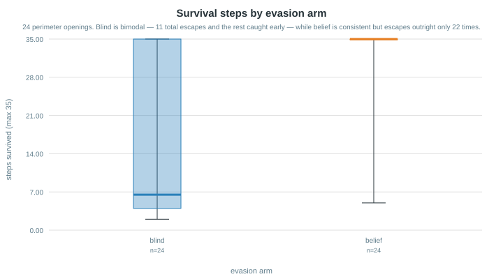
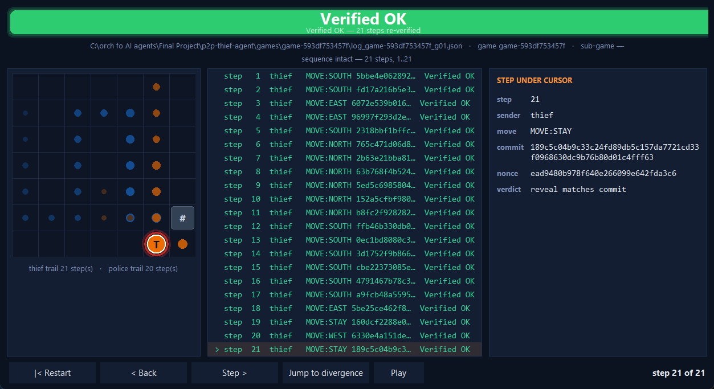
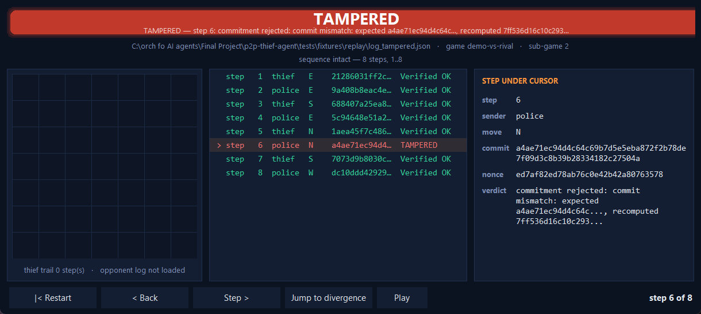
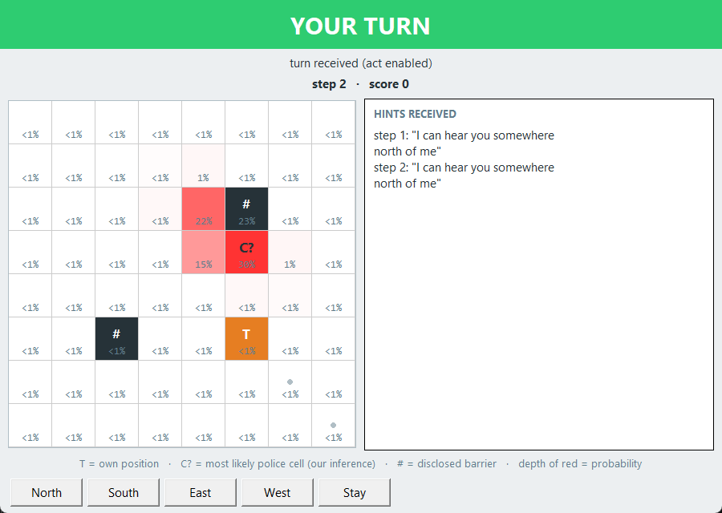

# P2P Thief Agent

Independently installable Thief-side package for the “Distributed Cops-and-Robbers over
a Peer-to-Peer Network” university project.

Companion Cop repository:
<https://github.com/SharbelMaroun/p2p-cop-agent>

## Milestone status

Counted from `docs/TODO.md` on 2026-08-08: **M0 18/18, M1 40/46, M2 24/24, M3 23/23,
M4 39/39, M5 78/83, M6 83/86, M7 86/86, M8 58/59, M9 76/93.**

The simulator-conformant protocol layer (commit-reveal, canonical hashing, wire messages,
signed-terms handshake) is implemented. M1's open rows are the conformance gate: the wire
profile is authored and adopted, but no acceptance verdict is recorded and the contract
checker stays fail-closed. M8's single open row (`M8-003c`, rehearsing against a real
classmate agent) needs a counterpart we do not have; the local rehearsal that *is* possible
was built instead as `M7-018`. M9's open rows are the league itself — counted games, the
tunnel, OAuth consent and Moodle — every one of which is the operator's action rather than
an agent's. M0's open rows are the book's internal contradictions the report must disclose.

**Where this stood earlier, kept because the milestone story is part of the record.** Until
2026-08-07 this section read "M7 at 84/86" and "**M9 has not started** (8/78)", and both were
true when written — the two open M7 rows were the OAuth consent flow (`M7-013`, `M7-013a`),
left deliberately unclaimed because running consent is the operator's action on their own
machine, and M9 genuinely had not begun. Saying so at each step is the point of this section,
not a lapse in it.

What changed on 2026-08-08 is only that the counts are **derived from the ledger** rather than
carried by hand. A snapshot is worth writing; an *undated* snapshot in the opening paragraph
is read as current, and this one had drifted a whole milestone behind the file beneath it.
Unresolved choices are raised explicitly rather than classified as blockers.

Version `1.00` began as an M0–M1 documentation and package scaffold. The inspected
baseline (`119fa911d5b1a5aecdaa9531d0912e5c6f9ab32f`) contained no Python package,
tests, `pyproject.toml`, or lockfile; that milestone added those engineering
foundations.

The M2 core domain — coordinates, board geometry, legal movement, barrier rules, and
capture conditions — is now implemented behind the public SDK under the 2026-07-28
coordinator authorization for contract-independent domain work. It uses only Appendix
E/F `CONFIRMED` rules, takes every board and position input explicitly, and depends on
no shared-contract byte, MCP endpoint, or Cop-owned file. See
[M2_DOMAIN.md](docs/M2_DOMAIN.md).

Commit-reveal, canonical hashing, the wire message types, and the signed-terms
handshake are implemented as pure protocol logic under `src/p2p_thief_agent/protocol/`
and documented in [SIM_WIRE_PROTOCOL.md](docs/SIM_WIRE_PROTOCOL.md).

Since then the FastMCP transport has been built on both sides — a server mailbox and
an outbound client, confined to `adapters/` by a guard test — together with the
private opponent-URL boundary and the pre-play agreement gate, which refuses a
mismatched match **by name** before a first move exists. A message has crossed a real
socket between two operating-system processes, closing the book's stage-2 milestone.

The turn loop now exists too: a bounded sub-game runs end to end through a declared
phase machine and reveals its audit, with both crossing a real socket into a separate
operating-system process.

Since then the M6 perception layer (scent field and belief map), the verbal/LLM layer, the
M7 artifact and email-report pipeline, and the M8 **replay verifier** have all been built.
The verifier reaches `Verified OK` or `TAMPERED` on a saved log — including one this
repository did not write — and reports structural damage separately from the cryptographic
verdict.

**Both GUIs now exist and both mandatory screenshots are real captures** (§5 below): a live
belief-map window taken during a two-process match, and a replay viewer showing `Verified OK`
over a log this repository actually played. `p2p-thief serve --peer … --game …` plays a whole
match over a socket, and `p2p-thief replay --log …` re-verifies a stored log from the command
line, matching the reference's own `replay --log` shape.

What is still absent is absent for a stated reason: a **public tunnel** (`shared/tunnel.py`
resolves and validates a public URL, but nothing here can open one — that is the operator's
machine and account), **OAuth consent and a live Gmail send** (credentials are deliberately
not in the repository under rules 39–40, so the sender is built but unexercised), and a
**counted league game**. Every match played so far is this team's Thief against this team's
Cop or a scripted peer — an engineering rehearsal, never described here as a league result.

Earlier Cop-bundle reviews are retained as historical audit evidence only. No
peer-owned file was integrated, and those bundles are not inputs to the current
Thief-authored conformance workflow. The dated findings remain in
[COORDINATOR_VERDICT_2026-07-28.md](docs/COORDINATOR_VERDICT_2026-07-28.md) and
[CONTRACT_REVIEW.md](docs/CONTRACT_REVIEW.md).

On 2026-07-28 the copy model was **superseded**. Under `THIEF-002` this repository does not
take the companion's bundle as a wire input and must play unknown classmate opponents, so
byte-parity with one peer would prove nothing about interoperability. (`THIEF-002` governs
wire *inputs*, not authorship — see
[SHARED_MATERIAL_AND_AUTHORSHIP.md](docs/SHARED_MATERIAL_AND_AUTHORSHIP.md).) M1 is therefore a
conformance gate rather than a copy gate: the Thief authors its own wire profile.

On 2026-07-29 that profile was re-based onto the reference simulator's wire
(`SIM_WIRE_PROTOCOL.md`), replacing the earlier Option-B profile. The Node neutral-stub
harness and the conformance tests written against the **old** profile were retired with
it and now sit unused in `archive/pre-sim-realign/`; the current profile has **not** yet
been proved bidirectionally against any independent stub. Re-establishing that evidence
is open M1 work, and the contract checker stays fail-closed until it exists. See
[CONTRACT_HANDOFF_CHECKLIST.md](docs/CONTRACT_HANDOFF_CHECKLIST.md).

## Install and inspect

Python 3.11 or newer and
[uv](https://docs.astral.sh/uv/) are required.

```text
uv sync --frozen
uv run p2p-thief --help
```

The CLI has three verbs: `serve` starts this peer's mailbox and, given `--peer`, plays a whole
match; `replay` re-verifies a stored log and prints its banner; `verify` is the same check
with an exit code instead of output.

## Quality gates

```text
uv run ruff check .
uv run pytest --cov --cov-branch --cov-fail-under=85
uv run python scripts/check_file_lengths.py
uv run python scripts/check_secrets.py
uv run python scripts/check_shared_contracts.py
```

The conformance checker remains fail-closed at `PENDING` until an exact accepted
profile revision is recorded. This is honest incomplete evidence, not a blocker on
profile or conformance work.

## Confirmed boundaries

- Cop and Thief are separate processes and repositories with no shared memory, database,
  runtime filesystem, or private truth (`SR-001`, `SR-004`, `THIEF-001`).
- The **wire** is authored without reference to the companion Cop repository: it is matched
  against the book and the pinned reference simulator, because league play is against
  classmates and matching one sibling would be evidence about that sibling only
  (`THIEF-002`). Interoperability is demonstrated against a neutral stub sharing no files
  with either side. **This is a design-input discipline, not an authorship claim** — both
  repositories are written by the same team and share support code, which
  [SHARED_MATERIAL_AND_AUTHORSHIP.md](docs/SHARED_MATERIAL_AND_AUTHORSHIP.md) itemises. The
  separation the rules require is at run time (rules 1 and 2), and that one is structural.
- Legal moves are north, south, east, west, and stay; diagonals are illegal
  (`AF-015`).
- Barrier placement is disclosed; a barrier on the Thief’s current cell and a trapped
  Thief are captures (`AE-015`, `AE-046`).
- SHA-256 commit-reveal, secret nonces until reveal, explicit state machines,
  illegal-transition rejection, deadlines, watchdogs, and public tunneling are required
  (`AE-004`, `AE-006`, `AE-010`, `AE-017`).
- Live GUI information is local truth only (`AE-008`).
- Appendix F values are recorded as `AF-013`–`AF-022`; artifact-example key-set
  observations are recorded as `JS-001`–`JS-003`, with provenance still unresolved.
- Deterministic movement is the project default. Appendix E rule 25 is a
  recommendation, not an automatic mandatory sanction (`AE-025`).

See the [requirements ledger](docs/REQUIREMENTS_LEDGER.md), [verified parameter
baseline](docs/PARAMETERS_BASELINE.md), [JSON artifact evidence](docs/JSON_ARTIFACT_SCHEMAS.md),
[book/template reconciliation](docs/BOOK_TEMPLATE_RECONCILIATION.md),
[proposed gate-resolution review](docs/GATE_RESOLUTION_REVIEW.md),
[unknowns](docs/UNKNOWN_REQUIREMENTS.md), [conflicts](docs/SPECIFICATION_CONFLICTS.md),
[repository audit](docs/REPOSITORY_AUDIT.md), [independent contract
review](docs/CONTRACT_REVIEW.md), [contract handoff
checklist](docs/CONTRACT_HANDOFF_CHECKLIST.md), and
[M1 verification record](docs/M1_VERIFICATION.md).

## Architecture boundary

All future business behavior must be reachable through the public SDK. CLI, GUI, MCP
transport, and external integrations may adapt inputs and outputs but may not contain or
duplicate business logic. The present package exposes the implemented M2 domain and
deterministic baseline through the SDK; protocol, orchestration, service, and UI
packages remain explicit boundaries for their later milestones.

Historical configurations remain quarantined under `config/drafts/`; runtime code must
not load them. Local private TOML and real `.env` files are ignored.

## Configuration

Configuration is split in two, and the split is load-bearing (`ADR-0004`).

- **Shared, signed, byte-identical.** The per-match game object holds everything
  that shapes the game — board, movement, scoring, scent, league counts. Both peers
  must hold the same bytes; it is hashed and signed during the pre-play agreement,
  and any differing term refuses the match **by name**.
- **Private, local, never sent.** `config/thief/game.toml` holds this peer's own port,
  the opponent's URL, model choice, credentials, and per-turn commitment nonces.
  `config/thief/game.toml.example` is the committed skeleton in the Thief's own role
  directory, matching the book's page 131 and the reference's own `config/thief/game.toml`;
  the real file is git-ignored.

The opponent's address is read only from `[network].opponent_url`, by
`shared.private_config.load_opponent_url`. The shared object must carry no URL,
port, or host at all — `assert_no_network_address` refuses one that does, whether
the address is named like an address or merely looks like one.

## Usage

This peer is runnable. With `--peer` it negotiates, plays every commit-reveal turn, answers
capture claims, reveals its audit, and writes the artifact set a counted game owes:

```text
uv run p2p-thief serve --port 8801 --peer <opponent mailbox url> \
                       --game <shared match config json> \
                       --private config/thief/game.toml \
                       --artifacts games/<game_id> --sub-game 1
```

Without `--peer` it only listens. The full match-day procedure, including the tunnel step, is
[docs/MATCH_RUNBOOK.md](docs/MATCH_RUNBOOK.md). To re-verify a stored log:

```text
uv run p2p-thief replay --log games/<game_id>/log_<game_id>_g01.json
uv run p2p-thief verify --log <path>          # exit 1 if TAMPERED
```

The version probe:

```text
uv run p2p-thief --version        # 1.00
uv run python -m p2p_thief_agent --version
```

A message crossing a real socket between two operating-system processes — the
book's stage-2 milestone — is exercised by:

```text
uv run pytest tests/integration/test_localhost_two_processes.py -v
uv run pytest tests/integration/test_negotiation_gate.py -v
```

To regenerate the two submission screenshots from committed inputs:

```text
uv run python scripts/capture_replay_screenshots.py   # Verified OK and TAMPERED
uv run python scripts/capture_live_gui_screenshot.py  # live belief map
```

What this section still cannot show is a game against a classmate; that needs the tunnel and
an opponent, and the procedure lives in the match runbook rather than in a promise here.

## Contributing

The gates enforce the standards, so a change that passes CI already meets them:

- **Style.** `ruff check .` with no findings; do not add per-file ignores to
  silence one.
- **File length.** No file over **150 lines** (`scripts/check_file_lengths.py`).
  Split by responsibility rather than deleting explanatory comments.
- **Tests.** `pytest --cov --cov-branch --cov-fail-under=85`. New behaviour needs a
  test that would fail without it. Prefer pinning a rule to the document that states
  it, so an edited constant fails here rather than in a match.
- **Secrets.** `scripts/check_secrets.py` must report zero findings. Ports, the
  opponent URL, credentials, and commitment nonces stay in the git-ignored
  `config/game.toml` or `.env`.
- **`THIEF-002`.** No task may be satisfied by reading, cloning, or inspecting the
  companion Cop repository as a **wire** input. The pinned simulator is the sanctioned reference:
  match its wire, never copy its source.
- **The contract checker** (`scripts/check_shared_contracts.py`) is **fail-closed**
  and exits non-zero while no accepted parity manifest exists. Never edit it to
  pass.
- **Commits.** Stage explicit paths, never `git add .`. Say what changed and *why*,
  citing the authority (book section, Appendix E/F rule, ADR) when the change
  encodes a rule.
- **Documentation.** A behaviour change updates `docs/TODO.md` and every document
  asserting the old behaviour; `docs/PROMPT_LOG.md` records significant AI-assisted
  steps with the problem found and the lesson drawn.

## Report

The graded report has six sections. Sections needing a completed match are marked
blocked rather than filled with claims we cannot show.

The full academic report body — the formalism in LaTeX, every architectural decision with
what it cost, and the measured results — is in [docs/ACADEMIC_REPORT.md](docs/ACADEMIC_REPORT.md).
Quality evidence against ISO/IEC 25010 and the book’s four success metrics is in
[docs/QUALITY_EVIDENCE.md](docs/QUALITY_EVIDENCE.md); the honest scoring is in
[docs/SELF_ASSESSMENT.md](docs/SELF_ASSESSMENT.md).

### 1. The Dec-POMDP model

The game is a **decentralised, partially observable Markov decision process**.

- **Decentralised.** No server, no referee, no shared memory. Each peer runs in its
  own operating-system process under its own configuration directory and the two
  communicate only by message. Neither can inspect the other, so fairness rests on
  cryptography rather than trust — and under `THIEF-002` this repository is developed
  without access to the companion peer at all, so the opponent is genuinely unknown.
- **Partially observable.** The Thief never learns the Cop's position. Each turn it
  observes its own position, the barriers it has discovered, the Cop's hint, the Cop's
  public **scent field**, and a commitment hash. Barrier placement is disclosed, so the
  map of known obstacles grows as the game proceeds. From the scent and the hint the
  Thief maintains a Bayesian **belief** — a probability distribution over where the Cop
  might be, never the Cop's actual cell, so partial observability is preserved and the
  belief never crosses the wire (see the strategy section).
- **Markov decision process.** State is the two positions, the barrier field, and the
  step index; actions are `N`, `S`, `E`, `W`, `STAY`; transitions are deterministic
  given both actions. Rewards come from the fixed Appendix F table: capture pays the
  Thief 5, survival 10, a tie 2, and a technical loss **zero to both sides**.

The asymmetry favours the evader in one respect and not another: the Thief **moves
first** every turn and only has to survive the step limit, but it cannot place
barriers, so it can never shape the board — it can only read it.

The Thief's local state is deliberately incapable of holding the Cop's position:
`ThiefLocalState` carries only the board, its own position, its known barriers, and
the step. The Zero-Trust property is enforced **by construction**, not by discipline.

### 2. The FastMCP communication dilemma

Two agents must talk to play, yet every message is a chance for the opponent to cheat
or to learn.

**Simultaneity without a referee.** Whoever announced a move first would be at the
other's mercy, and there is no third party to hold both. **Commit-reveal** resolves
it: each peer hashes its private decision with a fresh nonce and sends only the
digest, so no decision can change after seeing the other's. Nonces stay secret until
the post-game audit, where every commitment is recomputed; one mismatch is an
automatic zero with no appeal, which makes an audit failure worse than a lost game.

**Deception is legal; forgery is not.** The Thief may lie in its hint — that is the
strategic layer the project is about — but the lie is sealed. It declares `intent` as
truth or bluff inside the commitment, so at audit the opponent learns exactly which
hints were honest. A player may deceive within the turn and cannot deceive about
having deceived.

**What crosses the wire.** The book describes a per-turn phase where peers exchange
their actual moves. The pinned reference sends **none**: the live message carries the
hint, the scent grid, and the commitment hash only, while the move, true position,
bluff verdict, and nonce stay private until the audit (`C-022`). This repository
follows the wire, because interoperability is decided by what crosses the socket.
That decision cost real work — an earlier iteration implemented the book's live
reveal step and had to remove it (`P-020`), which is the most instructive mistake in
this project's history.

**Trusting an unknown opponent.** League play is against classmates, so a peer's
replies cannot be assumed to match ours. Outbound we accept any reply that does not
explicitly refuse; inbound our tools always acknowledge and validate afterwards, so a
content rejection is recorded as a game outcome rather than raised at the sender as a
network fault. Strict in what we send, generous in what we accept.

**Refusing to play is a feature.** Before a first move exists, the pre-play agreement
compares every negotiated term against our own and refuses a mismatch **by name**,
enforcing the Appendix F floors — `Fixed` values exactly, `Minimum` values only in
the harder direction. A refusal an opponent cannot act on would be worth little.

**Bounded waiting (added 2026-08-01).** Every wait is now finite. The book is blunt
about why — *"Missing a Deadline is a Failure, Not Patience"* — and permits only two
outcomes when an expiry passes: retry, or declare a technical loss and clear the
queue. An un-expiring pending request is named as the direct path to freezing. So
each attempt carries its own expiry, retries stop at the agreed limit, and an attempt
that overruns its own deadline is **not** retried: the retry budget does not rescue a
missed deadline.

The four limits live in the **shared, signed** match object rather than private
configuration, which is the part worth noticing — a peer able to set its own timeout
could stall an opponent legitimately. Reading them from the agreed bytes makes that
impossible rather than merely impolite.

*Problems hit building it.* Three. The reference notebook froze twice and the query
had to be re-sent three times before it submitted — logged rather than skipped,
because a tool failure is not permission to skip a verification step. Re-reading the
ledgers first turned up two rows still marked open for work already finished, which
would have sent someone to redo it. And the book PDF contradicted our own parameter
baseline in a small way: Appendix F table 19 marks the watchdog timeout
**`Negotiation`**, not `Minimum` like the retry limits beside it — a distinction that
matters, since a `Minimum` may only be tightened while a negotiated value can move
either way. Both baselines were corrected.

**The Gatekeeper (added 2026-08-01).** Outbound calls now pass through a rate
limiter that queues overflow instead of refusing it. The guidelines are explicit -
*"Overflow is queued, not rejected"* - which inverts the usual instinct: a busy gate
tells the caller to wait and **keeps** the work, and only a genuinely full queue
fails, loudly, because silently discarding a call is worse than admitting defeat.
The limits (30 requests/minute, 2 concurrent, queue depth 100) come from the signed
match object, so neither peer can quietly give itself more room.

*Problems hit building it.* Two, both about scope rather than code. Idempotency was
already done - the receive-side intake had been deduplicating and rejecting replays
since an earlier milestone - so checking first turned a planned feature into a
verification. And the book narrowed it again: the Gatekeeper guards **outbound**
Gmail and LLM calls against rate-limit bans, not the inbound peer mailbox. Building
it as an inbound queue would have been a plausible and completely useless answer.

Worth recording: our own task title said *"FIFO queue depth"*, and the book turned
out never to say FIFO - it was our inference wearing a citation. The word was
removed. A task that credits the book for something the book never said is how an
invented requirement becomes permanent.

**The Watchdog (added 2026-08-01).** Where a deadline bounds a single request, the
watchdog watches the whole game loop. If no heartbeat arrives for longer than the
agreed `watchdog_timeout_sec`, it performs a **controlled shutdown**: `persist_state()`
to save the game for later recovery, then `controlled_shutdown()` to release the MCP
connections and close the logs — in that order, once, and with teardown guaranteed to
run even if saving state fails. Time is injected, so a freeze is exercised by passing
a number rather than sleeping through minutes. This closes the `M5-004` reliability set
(deadlines, watchdog, mid-turn-disconnect terminal loss, backpressure). A dropped send
mid-turn has no deadlock exit: the turn loop routes it, and every sub-game to a
terminal technical loss whose audit is still revealed, is proven by test.

*Problems hit building it.* Two worth recording. First, no NotebookLM tool was
available in this environment, so — with the coordinator's authorization — the work
was verified against the higher authority the notebooks only summarize: the book PDF,
Appendix E/F, and the authorized reference simulator on disk. Second, that simulator
implements **no watchdog at all** — a book-mandated pattern it skipped — which removed
any wire or interop question and left the book as the sole authority; the boundary
(`elapsed > timeout`) was therefore taken from its page-83 code verbatim, deliberately
unlike the deadline's `>=`.

#### The play loop: driving the mailbox (`M5-019`, 2026-08-02)

The FastMCP server this peer runs is a **passive mailbox** — its four tools enqueue the
opponent's message, acknowledge it, and do nothing else. The turn loop is the mirror
image: it consumes a message and never looks for one. Nothing joined the two, which
meant every sub-game test had to hand the loop a *scripted* opponent, and a peer could
not play a match unattended.

The join is a polling turn source. Each wait drains the mailbox, hands back the next
turn the peer **accepted**, and is bounded — Appendix E rule 6 makes a deadline
mandatory "to prevent deadlocks while waiting for the opponent", so silence returns
`None` and the loop takes its declared exit to `TECHNICAL_LOSS` instead of blocking.
The wait also **pulses the heartbeat every iteration**, because book section 8.4.2 puts
the watchdog on the main game loop and waiting for an opponent is precisely the window
in which a frozen peer and a patient one are indistinguishable.

Three behaviours in the mailbox side are there because each would otherwise break an
unattended match invisibly: a *rejected* turn is consumed (leaving it queued makes the
poller re-reject it forever and starve the real turn behind it), a *second* queued turn
is left in place (draining both discards the next step rather than playing it), and the
other three mailboxes are drained first (a control or audit message parked in front of
a turn stalls the game). A whole sub-game now plays with **no message fed in by hand**.

**The Thief's asymmetry matters here.** This peer *opens* every cycle — the book gives
it the first move — so step 1 sends without waiting and the poller becomes load-bearing
from step 2 onward. The mirror-image mistake is not hypothetical: a Thief that waits
for step 1 deadlocks against a Cop that is correctly waiting for it, and the companion
repository's test harness contained exactly that error until a failing test exposed it.

*Problems hit building it.* The two notebooks appeared to **contradict each other**:
the reference drives its runtime by polling its own inboxes at `poll_interval_seconds`,
while the book mandates a strict state machine rather than a loop. Treating that as a
conflict would have meant choosing one and quietly dropping the other; the actual
resolution is that they answer different questions — polling is only *how* a queued
message is picked up, and the phase machine still decides what may legally follow.

*What is still not built.* The `serve` CLI (`M5-019e`). `build_server(...).run()` is a
blocking call, so launching a peer needs the server on a background thread plus
autonomous negotiation sequencing. A **passive** `serve` — one that mailboxes without
playing — was rejected in the companion repository as proving connectivity rather than
a game; that decision is honoured here rather than quietly reversed.

*A blocker that got worse on inspection.* The book's stage-5 milestone requires
**screenshots from the Replay App showing "Verified OK", plus the Live GUI belief map**
as its evidence. Both are `M8` deliverables, so the two-machine game cannot be
*evidenced* even once the hardware and the CLI exist.

*A ledger gap this exposed.* `docs/TODO.md` had **no row at all** for the play loop —
the companion repo named it only inside a blocked row's prose, and here it was named
nowhere. The single most load-bearing missing piece in the repository was invisible to
any search for open tasks. It is now `M5-019`, with sub-rows.

#### Ledger reconciliation (2026-08-02)

That gap prompted an audit of every open `M5` row against the code actually present.
Six rows were wrong:

- **`M5-016` (backpressure) was already done and never recorded.** `services/gatekeeper.py`
  and nine tests implement it, one of which — `test_a_full_queue_refuses_loudly_rather_than_discarding`
  — states the row's Definition of Done almost verbatim. Closing it required no code.
- **`M5-012a`…`f` were stale.** The parent `M5-012` closed on 2026-08-01; its six
  sub-rows were left reading `PENDING` underneath a `DONE` parent. Four are superseded
  by `M5-014` and `M5-007`; two are genuinely done.

Three rows were checked and **confirmed genuinely open** — `M5-011` (adversarial-peer
proof), `M5-013a/b` (subsystem diagram and failure-path table), `M5-018` (SDK/transport
guard). The evidence of each check is written into the row so the next session does not
repeat it. That negative result matters: in conversation I had guessed `M5-011` and
`M5-018` were probably already satisfied, and both turned out to be real work. A
reconciliation that records only the good news drifts the ledger the other way.

#### Launching a peer: hosting and readiness (`M5-019e`, 2026-08-02)

With the play loop built, the next gap was the process to host it. Two mechanical
halves landed, both testable without a real match: `adapters/serving.py` puts the
mailbox on a **daemon** thread after a port pre-check, and `services/readiness.py`
waits — bounded — for an opponent that has not started yet.

**The bind address is the part worth reading.** The reference binds `127.0.0.1` (thief 8801, police 8802). The
book prints `mcp.run(transport="http", host="0.0.0.0", port=8000)` with the comment
"Bind the server so a tunnel can expose it publicly", and rule 10 reads "Use tunnels
to expose the local server to the public internet. **Sanction: Inability to compete
against opponents**". The reference is not wrong — it runs both peers on one machine —
but copying it would produce a peer that passes every local test and is **invisible
through the tunnel**, failing only at the two-machine rehearsal where it reads as a
network fault rather than a one-word bug. The book outranks the simulator, so the
default is `0.0.0.0` and a test pins it, because nothing local would ever catch a
change back.

Two smaller decisions, each guarding a hang. The server thread is a **daemon**, so a
finished match cannot be kept alive by a mailbox nobody is reading — the failure the
watchdog exists to catch, reintroduced at the process level. And `ensure_port_free`
runs *before* the thread starts, so a stale peer still holding the port fails loudly
at launch instead of yielding a server that never binds while the game loop waits for
messages that cannot arrive.

Readiness is deliberately **not** `deadlines.py` or `watchdog.py`. Those exist to make
waiting a failure, because rule 6 requires it. Startup is the one phase where an
unreachable peer is expected and harmless: before the game exists there is nothing to
forfeit. Keeping it a separate module is what stops that leniency leaking into the
match. It still gives up after `connect_timeout_seconds`, and returns `False` rather
than raising — nobody having launched the other process is an operator situation, not
a protocol fault.

*Problem hit.* The first `ensure_port_free` set `SO_REUSEADDR` on its probe socket out
of habit, and **the check silently never fired**: on Windows that option lets a socket
bind a port another process already holds, which is exactly the condition the function
exists to detect. A test that held a port and asserted the raise caught it. A
detection probe wants the strictest bind available, not the most permissive.

*Since closed (`M5-019f`).* Negotiation-to-first-move sequencing now exists in
`orchestration/negotiation.py`: send the signed offer, poll the agreements mailbox,
verify both directions, then open play — and because this peer opens every cycle, step 1
goes out without waiting. The paragraph that stood here said it was not built; that was
true when written and is no longer.

#### The scent lock that would have refused everyone (`M6-005`, 2026-08-05)

This repository already had a rule-23 scent lock, and reviewing it against a real
opponent showed it was built to fail in the one situation it existed for.

The lock was stamped **into the signed terms** by `with_scent_lock`, and `accept_offer`
compares terms over the *union* of both peers' key sets — so any opponent whose offer
lacked `scent_model_hash` was refused by name. The pinned reference simulator sends no
such key: it has no standalone scent hash at all, folding its pheromone parameters into
`config_sha256` instead. Every classmate who built on the reference would have been
turned away before the first move, over a message they had no reason to send, and the
refusal would have named a term they had never heard of.

So the lock moved **beside** the signed terms and became lenient in exactly one
direction: a peer publishing **no** lock is played, a peer publishing a **different**
one is refused. Appendix E rule 23 sanctions a *deviation from the formula* — silence is
not deviation. This mirrors the rule already settled for `config_sha256`.

The second half was subtler. `scent_model_hash()` took no arguments: it hashed this
module's own constants. Hashing your own constant proves only that you have not edited
your own file — it says nothing about the opponent. The eight cells at squared distance
5 that book Figure 4 never names (`U-025`) were a private constant inside that hash, so
two peers could only ever agree by coincidence. They are now a **negotiated parameter**
with a published default carrying no book authority, and the lock covers the agreed
model rather than our private one.

*Why `U-025` was never going to be ruled on.* It had sat open awaiting a decision. But
Figure 4 names five radial classes covering 17 of 25 cells and gives these eight
**nothing**, so there was no evidence for anyone to weigh. The book answers a different
question instead (p. 31): agree the emission and decay model, confirm both sides read it
identically, lock it with SHA-256 — and it *recommends* handing the opponent your scent
source, which `perception/scent.py` is already structured to allow (`M6-018`). An
unknown that no source can answer is not a blocked task; it is a design input.

*Problem hit.* The book notebook, asked what Figure 4 prints and told explicitly not to
interpolate, answered that **all 25** cells are printed, with diagonals at `0.42` and
the unnamed ring at `0.14`. `inst/police_thief_p2p_Summary.md:947-955` says five
classes, 17 cells, diagonals `0.20`. It had invented a sixth class and shifted the whole
ladder to cover the gap it was asked about. The mandatory `inst/` cross-check is what
caught it; without that step a correct emission table would have been replaced by a
fabricated one, with the tests rewritten to agree.

*A second guard earned its keep.* `M6-018` asserts `perception/scent.py` imports nothing
at all, so the module can be handed to an opponent as the book recommends. It failed on
a **docstring line beginning with the word "from"** — a crude check catching a real
property, which is the trade a shareability guard should make.

*The evidence.* The companion Cop peer, whose protocol layer is written separately, produces the identical
digest `e6aef097…`. Two implementations agreeing is the difference between an
interoperability contract and a number we hash alone and trust.

*Still open, and deliberately not folded in.* `min_center_intensity`. The reference
**requires** it and its `validate_agreement` fail-fast aborts without it; this peer
still refuses an offer that carries it (`U-023`, decided on the grounds that Appendix F
table 16 has three rows and no floor). Interoperability is not decided by authority
though — it is decided by what crosses the socket — so this remains a live mutual
incompatibility with any simulator-built opponent. It is a separate question, and
burying it inside a scent change would have hidden it.

#### A false claim in our own ledger (`C-024` follow-up, 2026-08-06)

While the companion Cop built its scent-wire layer, the two implementations were
compared — and this repository's `M6-006c` row was found to justify a correct decision
with a **wrong reason**.

The row said rounding every intensity to six decimal places gives byte-identical
serialisation on both peers, "the property the locked scent-model hash depends on."
It does not. `scent_model_record()` contains exactly `model`, `update`,
`center_intensity`, `decay_per_step`, `field_size`, and
`emission_profile_by_squared_distance` — the **model**, never an emitted value. Verified
by inspection. No lock and no interoperability property rests on the rounding, and a peer
that rounds differently is still fully conformant.

The rounding stays, because deterministic artifacts and readable logs are worth having.
The justification is corrected, because a row that credits a cryptographic guarantee to
something that does not provide it is how a future reader builds on sand — the same
failure mode as the "FIFO queue depth" citation that turned out never to be in the book.

*Also compared, and deliberately left alone.* This peer encodes a **sparse** grid with
silent cells omitted; the Cop sends the **full** window including zeros, matching the
reference. Both parsers accept both forms — verified by round-tripping each encoder
through the other's parser — because an absent cell and a zero cell mean the same thing.
The divergence is stylistic, so it is recorded rather than churned.

#### Pinning why the physical evidence wins (`M6-010b` companion, 2026-08-06)

`M6-010b` already proved the outcome the book requires: scent says top-left, a hint lies
bottom-right, and the Thief flees the scent. What that test could not say is *which*
mechanism produced the outcome — and measuring it showed the answer is not the one a
reader would assume.

The protection is structural, not a trust effect. A located scent peak concentrates
likelihood on a single cell while a directional claim spreads it across half the board,
so even a `0.04` trace — the faintest value in the book's emission table — outweighs a
contradicting hint held at **complete** trust. The existing outcome test would therefore
have passed with the trust machinery disabled.

So `test_evidence_priority.py` now pins the ordering itself, in both directions: scent
decides wherever it can, and a claim decides only what scent leaves open — given two
equal peaks, scent cannot choose and the hint breaks the tie. A hint that could never
change any decision would be dead code; one that could overrule scent would make the
book's lie detector pointless. The ordering is lexicographic, matching the weight-free
policies in `M6-004h`.

**This was written because the Cop repository reaches the identical ordering from a
different data structure** — a mapping of cells there against this grid of rows. Two
implementations agreeing by construction is worth locking down on both sides: belief
never crosses the wire (`M6-016`), so no handshake could ever detect the two drifting
apart. Only a test in each repository can.

The sources require less than this. `inst/police_thief_p2p_Summary.md:508` requires only
that a contradicted hint lower trust *and* update the map; `:1020` gives the behaviour —
the pursuer "**ignores** the verbal claim and **continues** to track the actual scent
source". No trust floor or "ignore a liar after N turns" rule is defined anywhere, so the
decay schedule and the `[0, 1]` clamp are engineering, and are labelled as such.

#### Where our evasion evidence is weaker than the Cop's (`M6-019` note, 2026-08-06)

`M6-019` records that the deterministic evader survives 52 turns against a random legal
walk's 39.6, meaned over five seeds. That result stands and is not withdrawn.

But the Cop repository measured its equivalent claim the same day with a stronger design,
and a reader comparing the two reports should not read equal confidence into both. Ours
is the weaker evidence, on three counts:

* **Unpaired.** Five separate means cannot say whether a win came from the policy or from
  the draw. The Cop's opponent does not react to the pursuer, so on a given seed every
  arm meets the *identical* trajectory and outcomes compare seed by seed — it reports
  21–0 on matched pairs, which five averages cannot express.
* **No ceiling.** The Cop includes an `oracle` arm that reads the true position (not a
  legal agent), so its headline is a share of the *available* gap rather than only
  "better than random". Beating a random walk is a low bar and ours is stated against it.
* **Five seeds, no stability check.** The Cop used thirty, re-checked at 100 and 300.

Recording this rather than quietly leaving two differently-rigorous numbers side by side
is the point. Applying the same design here is logged as a candidate follow-up on the
`M6-019` row; it was not done in this batch, because that row is closed and re-opening a
teammate's finished work mid-batch is a call for the team, not a side effect of ours.

#### The Cop's bundle no longer contradicts this repository (`X-03` cross-check, 2026-08-06)

`CONTRACT_HANDOFF_CHECKLIST.md` has said since 2026-07-28 that the copy model is retired
under `THIEF-002` and "must not be revived". The Cop repository agreed in principle but
not in text: its shared bundle still opened by telling readers it "can be copied into the
Thief repository byte-for-byte", and its verifier header said the same. Two deliverables,
two different instructions.

That is now fixed on the Cop side (`X-03`, bundle `0.2.7-proposed`), and the correction
sharpens something worth recording here too. The retirement is **not** a general rule
against sharing. Chapter 6 recommends publishing the scent model so both sides run
identical logic — which is why `M6-018` deliberately keeps `perception/scent.py`
dependency-free and offerable verbatim. Appendix E rule 2 prohibits sharing *memory or
variables* ("immediate disqualification due to data leakage"), not specifications.

What the retirement actually rejects is **byte-parity as evidence**. The book's evidence
of interoperability is a `Verified OK` replay of a real match, and Appendix E rule 52
permits warm-up games for exactly that purpose — which is the standard `M1-015`–`M1-017`
are working toward, and a stronger one than copying files could ever provide.

#### An opponent that shares none of our code (`M1-015`, `M1-016`, `M1-017`, 2026-08-06)

Every interoperability test in this repository until now drove our client against our own
server. That proves less than it looks: both sides share the constant a typo would live
in, so the typo cancels out and the suite stays green. `tests/conformance/` fixes that.

`neutral_peer.py` imports **nothing** from `p2p_thief_agent` — standard library only —
and re-derives canonicalization and the commit construction from `SIM_WIRE_PROTOCOL.md`
rather than calling ours. When our sealed message verifies over there, two
implementations agree.

**Demonstrated rather than asserted.** Changing the commit separator in
`protocol/crypto.py` from `|` to `:` — one character — fails four conformance tests and
nothing else in the suite. It reproduces our digest on a float (`31.8`) and a non-ASCII
payload (`café`), the two cross-language hazards a Python-only test cannot surface.

The wire half matters separately. `test_conformance_wire.py` drives the production
`FastMCPClient` against the stub behind a real FastMCP server, and discovers the tools
the way a stranger does — over the wire, with a plain MCP client, not by reading our own
constants. If our client called a tool a peer registered under another name, every rule in
the project could be right and the two agents would still never exchange a message. The
rules-level suite would stay green throughout, because it never uses a name.

**Where the sources stop, and where we say so.** `M1-017`'s seven categories each map to
a numbered Appendix E rule — participant/config to rule 11 (Mandatory, "disqualification
due to lack of symmetry"), hash to rule 19 (Mandatory, iron rule, score 0), private
leakage to rule 2 (Prohibited, immediate disqualification), replay to rule 29. Two do
not. A *version* refuses through rule 11 because it is a signed term, not because a rule
governs versions. And **ordering has no rule at all**: asked directly, the reference does
not gate ingestion on step sequence — it queues a duplicate for the peer loop. So the
stub accepts one by default and refuses only under `strict_ordering`, which is ours. A
stub stricter than every real opponent would have us "fix" behaviour that was never
wrong.

**A limit this suite does not overcome.** The stub and the agent it tests were written by
the same team in the same session. "Independently authored" holds at the level of source
files, imports, and re-derived constants — it does not reach the strongest form, a
different author entirely. The book's own standard for interoperability evidence is a
`Verified OK` replay of a real match, and Appendix E rule 52 permits warm-up games for
exactly that. This is a floor, not that ceiling.

*Two defects found on the way.* The profile still said `TurnMessage` and `AuditPayload`
"reject unknown fields"; the code has ignored them since the `X-02` fix, so a classmate
implementing to our published wording would have expected a refusal we no longer give.
And a notebook asserted that `submit_audit` was "an error" and `exchange_audit` "the only
registered tool name" — while admitting the `@mcp.tool()` lines were truncated and it was
reading the *client*. `OPTION_B_INTEROP_DECISION.md` had already settled it: the reference's
`exchange_audit` is a client-side method that calls the server's `submit_audit`. That
confusion has now surfaced twice, so the profile records it for whoever asks next.

#### Two ways a config is wrong that value checks never see (`M1-017b`, `M1-017c`, 2026-08-06)

`check_appendix_f` already refused an altered `FIXED` value and a weakened `MINIMUM` one.
Both inspect *values*. The two vectors left open inspect the document's **shape** and its
**membership**, and neither had any guard at all.

**Duplicate keys.** `json.loads('{"a":1,"a":2}')` returns `{"a": 2}`. Nothing raises. The
collision is resolved and forgotten before any of our code sees the object, so no check on
the parsed dict could ever find it — the refusal has to happen in `object_pairs_hook`,
the one place the duplicate still exists. Appendix E rule 11 is the citation and it is
Mandatory: the configuration must be "identical, bit-for-bit, on both sides", sanction
"disqualification of the game due to lack of symmetry". A document with a repeated key
cannot satisfy that, and a signature computed over the raw bytes would be verifying a
different object than the one we parsed.

**Private fields in the shared config.** The book splits configuration by format for
exactly this reason (`:2901`): the private `config/game.toml` holds "network port, choice
of strategy models, language mode, LLM settings, email, and group identity", while the
shared JSON carries the agreed match conditions; `:3001` adds that the private file is
"not subject to negotiation". So a private key in the negotiated object either leaks how
we play — the strategy selection is the graded contribution — or drags an unnegotiable
local value into a document both sides must hold identically. Six classes, one refusal
each, taken from that sentence rather than imagined. The refusal names every offending
key, because rule 11's purpose is that both sides converge on one document and a refusal
that names one mistake at a time takes as many rounds as there are mistakes.

**A bug caught while writing the version guard.** The first version refused anything but
`1.2`. Our own `reporting/declaration.SCHEMA_VERSION` is `1.1` — the artifacts version
independently of the match config, so a single global set would have made the guard
refuse our own declaration artifact. The supported set is now a parameter, and a test
pins that the two spaces are deliberately separate.

**Where this is honest about its own limits.** Nothing in this repository reads a JSON
config or artifact back yet — we only emit. So both guards are proven and reachable
through `sdk.protocol`, but they are not yet on a live path. Their use site is `M7-14`
(validate every emitted artifact) and `M7-23` (bind the config artifact to the negotiated
match), and the rows say so rather than implying protection that is not switched on.

*And an error of mine, corrected.* `M1-017` was marked DONE earlier the same day while
`a`, `b` and `c` were still open, and the suite that closed it covered none of them. The
parent was reopened rather than left standing as evidence it was not. `M1-015a` closed
alongside, proven by injection: renaming the stub's `submit_audit` fails three tests
including a real transport error, and passes again on revert.

#### Labelling the wire, and the one place we leave the book (`M1-013`, `M1-013a`, 2026-08-06)

Stage A of the conformance checklist had every box ticked. It certified
`WIRE_CONFORMANCE_PROFILE.md`, `protocol/canonical.py`, `commitment.py` and
`negotiation.py` — **every one archived or deleted by the simulator realign**. A ticked
box citing a deleted file is worse than an empty one, because it reads as evidence.

`SIM_WIRE_PROTOCOL.md` now carries an authority table covering every item, in four
strengths, because conflating them lets a code listing borrow a rule's sanction:
**book-mandatory** (a numbered Appendix E rule *with* a sanction), **book-confirmed**
(the book states it, no sanction), **book-minimum** (an Appendix F floor that may be
raised), and **simulator-derived** / **Option-B** / **project choice** for everything the
book does not speak to. Which is most of the wire: neither `submit_audit` nor any other
tool name appears in the book at all.

**The one place we knowingly leave the book.** `:1107` states
`H_commit = SHA256(State || Move || Intent || Nonce)` — the nonce **inside** the hashed
string. We hash `canonical_json(payload) + "|" + nonce`, with the nonce outside, matching
the reference. `test_reference_vector.py` reproduces the digest `78a31c51…` from a real
reference match log; the book's literal construction yields a **different** digest on the
same record. Following the book here would fail every cross-peer audit against any
classmate who used the simulator — which is all of them.

Rule 17 still holds. It mandates *"a commitment and disclosure protocol based on
SHA-256"*, which this is. What the book fixes is the mechanism; what it also prints is
one byte layout, and only the mechanism carries a sanction. That is precisely the
distinction the labels exist to keep visible, so the row is labelled
*simulator-derived — deviates from the book, deliberately* rather than allowed to borrow
rule 17's authority.

None of this is a prose promise. `test_profile_authority.py` asserts that no item is
unlabelled, that no simulator-derived item is marked mandatory, that every book claim
cites a rule, table or line, and that the profile no longer names an archived file.

**The citation test earned its keep immediately.** Canonical JSON went into the table as
`book-mandatory` on a notebook's say-so and the test rejected it for having no citation.
Checking `inst/` showed the book *does* fix `sort_keys=True, separators=(",", ":")` —
but at `:1212`, inside a **code listing**, not a ruled sanction. The label became
`book-confirmed`. Without the test that would have shipped as a rule that does not exist.

#### Mirroring the Cop's M7 work — by re-authoring, not copying (`M7-011`, `M7-016`, 2026-08-06)

The companion Cop repository built its artifact, gate, reporting and settlement layers
today. Bringing the same capability here does **not** mean copying it: `THIEF-002` forbids
this repository any access to that one, and `M1-015` already set the discipline for the
conformance stub. The design travels; the bytes do not. Both modules below are built on
*this* repository's own primitives — `protocol.crypto.audit_records` for the audit,
`reporting.naming` for filenames.

**The assessment came first, and narrowed the job.** This repository already had more than
the open-row count suggested: all four artifact builders, `email_report`, a gatekeeper
*and* a token bucket. What was genuinely absent was atomic persistence, schema validation,
the settlement layer and the six-sub-game schedule.

**`M7-011` closes a silent failure.** A crash mid-write leaves a file that *looks*
present. Rule 19's audit phase then reads a truncated artifact as a technical mismatch —
sanction "score of 0 for the falsifying group" — and nothing in the file distinguishes
truncation from deliberate forgery. The write goes to a temporary file in the **same
directory** and swaps in with `os.replace`; same-directory matters, because `os.replace`
is atomic only within a filesystem.

**`M7-016` encodes a distinction that costs money to get wrong.** Rule 19 scores 0 for
*the falsifying group*; rule 35 scores 0 for *both teams*. So catching an opponent's
forgery is not a reason to race them to the lecturer with our own number — that converts
their loss into a shared one. Failed audit and disagreed outcome are separate states with
separate remedies, and a test asserts the three refusals never collapse into one.

*Not claimed:* `M7-012`, validating artifacts against their schemas. This repository has
no artifact schemas, so that is a contract-shaped job — authoring them — rather than a
code one, and claiming it would have meant calling something validated that nothing checks.

#### Three gaps the mirror found, that copying would have hidden (`M7-006`, `M7-014b`, `M7-015c`, 2026-08-06)

The second slice of mirroring the Cop's M7 work, and the assessment mattered more than the
code. This repository already had a correct token bucket and an `email_report` module with
the right `AF-020` address — so the job was never "add the missing files". It was finding
what was **wrong**.

**One gate of three.** `:2096` requires Quota Manager → Token Bucket → DOS Detector before
any Gmail call. Only the bucket existed here, so a report could reach the API having
passed a third of its protection. The other two are now in `services/send_gates.py`.

**A deterministic subject that could not be assigned.** The subject named the game —
`UOH26 Final Result — <game_id>` — and carried no team code. Rule 45 (Mandatory) ties
**automatic report assignment** to the eight-character code, sanction "organizational
failure that will prevent automatic report assignment to the team". Deterministic and
unassignable are not the same property.

**`send_report` could be called twice for one game.** Rule 35 scores a conflicting report
0 for *both* teams, and a duplicate is the easiest way to produce one by accident. Now
keyed on `game_id`.

**And an API difference that copying would have carried straight past.** This repository's
`TokenBucket.allow` *consumes* a token; the companion repo's is a pure query. A gate
pipeline written against the wrong assumption would have burned a token on every request a
*later* gate refused — throttling us gradually for sends that never happened, and
reporting nothing. `attempt` inspects with `available`; only `send` calls `allow`. A test
pins it.

*One deliberate change to working code:* the 429 backoff went from constant to doubling.
Both honour Appendix F table 19's `Minimum` of 5 seconds, so the original was not a bug —
the test records the change and the reason rather than quietly rewriting the expectation.

#### What the Cop repository built on 2026-08-06, and what it means here

**Recorded late.** Eight M7 batches ran in the companion repository that day — the four
artifacts, the three Gmail gates, the reporting path, the settlement layer and the
six-sub-game series — and none of them updated this ledger at the time. The eight-step
method requires both repositories on every batch; I skipped it on the grounds that the
work was "Cop-only", which is not an exemption the rule offers. Two of those batches later
had to rediscover this repository's state from scratch during the mirror, which is exactly
the cost the rule exists to avoid. Written down here rather than quietly backfilled.

What matters for this repository, batch by batch:

* **The pre-game declaration** (`M7-22`) must carry the MCP addresses and the hardware and
  model declaration — `:2229` lists both, and rule 24 is Mandatory with the sanction
  "denial of eligibility for computational bonuses". A URL carrying a credential is
  refused there, since the declaration is committed *and* emailed and rule 39 forbids
  pushing secrets. Our `M7-020` will need the same two fields and the same guard.
* **The config artifact** (`M7-23`) carries **two** locks, not one: the agreed-config hash
  (rule 11) and the scent-model hash (rule 23, "deviation from the formula cancels the
  game"). Our `reporting/config_artifact` should be checked against that.
* **A schema defect** (`X-04`): the Cop's `per-subgame-config` schema pinned a filename
  with the literal pattern `g<NN>`, so it validated only a *template* and refused every
  real artifact. If we ever author artifact schemas for `M7-012`, that is the trap.
* **The log artifact** (`M7-24`) keeps nonces out of the in-play file entirely — rule 18's
  secrecy is about *when a byte exists*, and the finished log is byte-identical either
  way, so it can only be enforced by refusing to build the intermediate state.
* **The result artifact** (`M7-03b`) refuses an unagreed result at build time, and
  validation sits **between building and writing** rather than in a test suite (`M7-14`).
* **The three gates** (`M7-04`, `M7-08`) — mirrored here as `M7-006`, where the assessment
  found this repository had only one of the three.
* **Reporting** (`M7-05`, `M7-16`, `M7-17`) — mirrored here as `M7-014`/`M7-015`, where it
  found the subject carried no team code and a game could be reported twice.
* **Settlement** (`M7-06`, `M7-18`) — mirrored here as `M7-016`.
* **The series** (`M7-01b`, `M7-07`): six sub-games, 1/3/5 natural and 2/4/6 swapped per
  `U-025`. Appendix F prints **two rows** labelled `[Number of Agents]` (`:3484` = 2
  players, `:3540` = 6 per series) and the template says `num_games: 1` — three plausible
  numbers, recorded as `X-05` there. Our own series work will meet the same three.

#### Finishing M7: the four gaps only a whole phase reveals (`M7`, 2026-08-07)

Forty-two rows in three waves, and the interesting part is not the count — it is that four
defects were **invisible at the row level** and only appeared once the phase was taken as a
whole.

**Rule 53's commit hash did not exist.** The declaration named who played, on what hardware,
with which model, against whom, and never *which code*. Every row about the declaration
passed; the field nothing asked for was the one that makes a later audit reproducible.
`build_declaration` now requires it, and a truncated hash is refused too — a value short
enough to be ambiguous across the repository satisfies the rule's letter while defeating it.

**We were violating Appendix F obligation 4.** It requires every game's configuration to be
committed. `.gitignore` excludes `logs/`, `reports/generated/` and `results/generated/`, so a
config written under any of them lived on one laptop and nowhere the obligation could see —
silently, because the write succeeds and the file is there. `reporting/retention.py` now
stores under `games/` and **refuses** a destination under an ignored path; a test reads the
real `.gitignore` and fails if `games/` is ever added to it, since the way this regresses is
somebody tidying the working tree. The first draft of that guard was wrong in both
directions: it refused all of `results/` when only `results/generated/` is ignored, and its
agreement test passed on a substring.

**`compose_report` took a bare result mapping.** `settlement.agree(audit, ours, theirs)`
already took its audit first so the ordering could not be forgotten — but nothing stopped a
caller skipping settlement entirely and emailing a number the opponent had never confirmed.
Rule 36 puts the audit before agreement; rule 35 scores a conflicting report 0 for *both*
teams. The composer now requires the settlement record and refuses anything short of
`agreed` with `audit_passed is True` — `is not True`, not truthiness, because a JSON round
trip turning the flag into the string `"True"` would otherwise pass.

**The secret scanner had no tests of its own.** It has caught two real problems in this
repository, and its detection rules were unexercised because `findings()` read a file and
formatted a repository-relative path in one pass — so it could only be tested through a file
*inside* the repository. Splitting `line_findings` out fixed that. The new tests are mostly
positives: a scanner quietly widened is worse than no scanner, because the repository goes on
passing. Its own test file then failed the scan, correctly, and the probes were rebuilt as
runtime-joined fragments rather than allowlisted — an exemption for the one file where a real
key would look completely at home is the worst possible exemption.

**Two decisions were made by declining the obvious answer.** `M7-024` asks that a schema
change be visible, not silent; the obvious reading is to bump `SCHEMA_VERSION`, and that was
rejected. Every inspected template shows `1.1` and `U-019` leaves that provenance unresolved,
so emitting an unobserved number invites a peer matching on `1.1` to refuse our declaration —
a real cost paid against an open question. Visibility is enforced by pinning a digest of the
required field set instead, with a proof test showing the digest moves. And validation is a
**table, not a JSON Schema**, for the same reason: a schema generated from those templates
would demand keys no source demands and then refuse a conformant opponent, failing rule 36's
mutual audit over a difference nothing forbids.

**The rehearsal is what makes the rest checkable.** `tests/integration/rehearsal.py` plays a
whole series through the real builders, audit, settlement, ledgers and retention store —
only the transport is a double, because a rehearsal against test doubles rehearses the
doubles. Three files drive it: a clean run, one with a deliberately lost sub-game, and one
with a revealed move rewritten *after* its commitment was taken. The last is the one worth
reading. A technical loss must produce **exactly the same file set** as a clean series, not
merely "some artifacts" — and a detected forgery must produce artifacts and send **nothing**,
because racing them to the lecturer converts their rule 19 loss into a shared rule 35 loss.

*Left unclaimed:* `M7-013` and `M7-013a`, the OAuth consent flow. The consent screen is where
a human decides what a program may do with their mailbox, so it is the operator's to run;
`docs/RUNBOOK_reporting_setup.md` says so plainly rather than documenting an `authorize`
command that does not exist. Everything downstream of it — the refresh policy with its
300-second skew margin, the base64url envelope, the send gates — is built and tested against
injected doubles, which is what let the rest of M7 finish with no credential in existence.

#### Starting M9: what a history scan and a provenance check found (`M9-018`, `M9-010b`, 2026-08-07)

Four findings, and the pattern in them is the same: a guard that was correct and unreached.

**`running_git_commit` was called only from its own tests.** It has existed since `M4-006a`,
fail-closes properly on anything but a clean 40-hex SHA, and no production path ever invoked
it. Rule 53 is Mandatory, so a declaration that names the group, the hardware and the model
but not the code is unreproducible — and the failure is silent, because the artifact
validates and the key is present. The reference implementation has the same defect in a
louder form: it hard-codes `github_commit` to the string `"unknown"` for both sides.
`reporting/provenance.py` resolves it for real and refuses a placeholder.

**A resolved hash can still be the wrong answer.** `git rev-parse HEAD` replies happily with
uncommitted changes on disk, so the recorded commit does not contain the code that played.
`describe_provenance` reports both facts and `require_reproducible` refuses a dirty tree
before a *counted* game — fine while rehearsing, a broken audit trail once it counts.

**The working-tree secret scan answers the wrong question at submission.** Rule 39 forbids
secrets being *in the repository*, and a credential deleted three commits ago is in every
clone. `scripts/scan_git_history.py` walks every blob reachable from **any** ref, so a secret
on a merged-and-deleted branch is still seen, and checks paths as well as contents — a file
can be a credential without containing anything that matches a pattern. **This repository's
history is clean: 1709 objects, 0 findings.** That is precisely when a scanner's own tests
matter, since nothing would notice if it quietly stopped looking.

**The book contradicts itself about sending the report, and the contradiction is now
disclosed.** Rule 51 and §9.3.3 require the JSON report to be *sent*, and `inst/:2224` is
explicit that a side whose report is not received scores nothing "even if they won". But the
shipped config example sets `[email] mode = "draft"` (`inst/:3041`, `DEV-SPEC.md:228`) and the
book's own overview says "a JSON report sent via Gmail drafts" (`:3206`). Chapter 110 grants
the freedom to choose, provided the report states where the contradiction was found, what was
chosen and why. **We send.** A draft never sent scores zero under the rule with the explicit
sanction; sending costs nothing if the draft reading was intended. `draft` stays available as
a rehearsal mode.

Submission contents are checked rather than assumed: `scripts/check_submission_contents.py`
holds §9.4.1's list, §9.4.2's six README components, and the guidelines' per-mechanism PRD
requirement, reporting every gap at once. It checks **presence, never quality** — whether the
Dec-POMDP section is any good is a human judgement; whether it survived the last refactor is
not, and that is the question worth asking automatically.

#### The evidence bundle, and a correction the notebooks forced (`M9-010`, `M9-023`, 2026-08-07)

**A claim in `games/README.md` was wrong, and the book says so plainly.** That file justified
not committing game logs on the grounds that doing so would publish nonces, "and git history
has no end". Rule 18 (`inst/:3354`) keeps a nonce secret **until the end of the game**, and
the book defines Step 4 as the Final Reveal: "Only at the end of the game are all values,
including the Nonce, revealed for a full mutual audit" (`inst/:1136`, `:1155`). The
obligation *expires*. Revealed nonces are exactly what lets a third party recompute every
commitment — publishing them is the point. Corrected there, and the real reason recorded:
logs are not committed wholesale because no rule asks for it, not because doing so would leak.

That also narrowed `M9-023`. "Verify every emitted artifact is committed" reads as all four;
the book's obligations differ per artifact. The **config** is mandatory (Appendix F obligation
4, p.140/288). The **log** has no explicit commit duty but is needed to run the Replay app,
which rule 20 makes a threshold condition. The **result**'s duty is to be emailed (rule 51).
A checker that demanded all four would have failed the submission for satisfying the rules.

**"Proof the report was sent" cannot mean what it sounds like.** The book's decisive layer is
receipt at the lecturer's address (p.78/183) — "if a report is not received from one of the
sides, that side will not be credited for the game" — and a sender cannot observe receipt.
Only the recipient can. So the class is `SendReceipt`, not `ProofOfDelivery`, and every
record it writes carries `evidences: API acceptance, not receipt by the lecturer`. Overstating
this in an artifact would be a claim the lecturer's own inbox could contradict. The reference
implementation records nothing at all here: its sender returns `{status, reason}` for a CLI
line that never reaches the four artifacts.

**The clean-clone runner earned its keep on its first run.** Every gate passed in the working
tree; `verify_clean_clone.py` clones `HEAD`, installs from the lockfile with `uv sync
--frozen`, and re-runs them there — and immediately failed on two file-length violations. The
value is not cleverness, it is that a clone contains only what was committed, so a gate
script living untracked in a working tree cannot hide. Eight gates now pass on a fresh
checkout. It is deliberately **not** `M9-013a`: a local clone shares the OS, the Python build
and the uv cache, so it catches missing files and lockfile drift, never platform breakage.

**The replay row closes the loop a grader closes.** Every other replay test builds records in
memory. `test_replay_of_stored_match.py` plays a series, writes it as JSON, reloads it **by
path alone**, and re-verifies to `Verified OK` — then changes a byte in the file and confirms
`TAMPERED`. `json.dumps`/`loads` is not identity, and the commitment is over canonical bytes,
so a verifier that only ever sees in-memory dicts can pass forever while every stored log
fails. The first person to notice would have been whoever opened the submission.

#### A disclosure list that was closed while incomplete (`M9-011c`, 2026-08-07)

`M9-011c` reads "disclose every book contradiction relied on". It was marked done against a
list of four, and the register held six that the code relies on.

`C-014` and `C-015` had been in `docs/SPECIFICATION_CONFLICTS.md` since M6 — the scent
factor whose prose says "reduced by 90%" where the formula retains 90%, and the claim that
raising $
ho$ saturates the board when it empties it. Both were resolved correctly in code
at the time; neither was promoted into the disclosure the report owes a grader. Writing the
academic report restated `C-014` and I described it as newly found, which it was not.

**The fix is structural rather than an apology.** The register is the source and the handover
is a view of it, so `docs/HANDOVER.md` now says to diff the two before closing the row again.
The failure mode here is not missing a contradiction — it is a *derived* list drifting from
the list it derives from, silently, while the row that depends on it reads DONE.

The `M0-006` family closed in the same pass: those rows exist to move the register into the
report, and closing a disclosure row without touching them was how the gap survived.

#### The live Thief was blind, and would have lied when caught (`M9-026a`, `M9-026b`, 2026-08-08)

Asked to make both agents win, the finding here was worse than a weak strategy: the wire
adapter `M9-026` wired was the **blind baseline wearing the live loop's clothes**. It called
`baseline.choose_action` with no threats and no barriers, ignored the Cop's message entirely,
sent a hard-coded empty `smell_grid` — the exact rule-23 deviation the companion peer fixed on
its own side on 2026-08-06 — and a constant hint. Every M6 result existed only in the harness
while the wire played the arm that measures **worse than a random walk** in league points
(`M6-015c`). `make_decide` now absorbs the Cop's declared barriers and its scent into the
belief, evades with `choose_evasive_action`, emits the involuntary 5×5 own-trail window, seals
the real move and position, and claims survival on the threshold step so the opponent
terminates on our win instead of timing out into a disputed artifact.

Two of the problems hit were audit-fatal rather than strategic. `serve_match` defaulted
`answer_claim` to `lambda _cell: False` — a standing denial of every correct capture claim,
which the end-game audit proves from our own sealed positions and rule `[AE-021]` scores as a
forgery, zero for both sides, where an honest loss still pays 5. And the timing was wrong even
for an honest answerer: the sub-game loop asks *after* the turn's move is applied, so the claim
would be tested against the cell we fled to. Claims are now answered from the **pre-move** cell
by an answerer sharing `decide`'s own closure (an absent answerer refuses to play rather than
quietly lying), a confirmed capture pins the move to `STAY` so the sealed record shows the cell
we were caught on, and `claim_response` goes out the same turn, closing the loop that would
otherwise have left the Cop timing out on a game we recorded as its clean capture.

One measured reversal is recorded on the belief itself: a Bayes-recursive prior (carried and
multiplied every turn) calcifies on trail history — the companion's opponent grid lost a target
it tracks perfectly when rebuilt fresh, 40/40 → 0/40 on that change alone. The live loop
therefore rebuilds belief fresh per observation and carries the prior only across silent turns,
which is also exactly what the `M6-015` harness arm measures, so the live Thief plays the
policy the published numbers are about. Still open, deliberately: the anticipating-Cop gap
(8/24 escapes against a one-step-ahead pursuer, solver ceiling 24/24) — the five failed
attempts are in `docs/RESEARCH-REPORT-Performance-Analysis.md`, and the companion's new grid
shows the same phenomenon from the other side: its truth-aimed barrier stack cannot corner a
distance-plus-mobility evader either. The next attempt should model the pursuer from observed
moves; nothing tried so far has beaten shipping `distance + mobility`.

#### The sixth attempt fails, and finally says why all six did (`M6-029`, `M6-030`, 2026-08-08)

The "model the pursuer from observed moves" attempt was built and measured the same day it was
proposed: the three pursuer archetypes are now committed code (`strategy/pursuer_models.py` —
the report's stronger-Cop rows previously existed only as numbers from scratch code), an exact
escape solver answers "can the horizon still be reached from here?" perfectly against any of
them (`strategy/escape_search.py`), and an adaptive policy classifies the pursuer online from
the believed trajectory and plays the best-fit model's escape set. Committing the models
corrected the record first: the committed herding and anticipating are stronger than the
scratch versions, so the shipped policy's honest row is **23/24 greedy, 8/24 herding, 5/24
anticipating** — not the 23/23/8 published before.

The attempt itself is a measured negative and is **not wired**: argmax-fed it scores 23/4/4
against shipped's 23/8/5, a top-2 uncertainty set is worse still, and robustness on a larger
board and a longer horizon agrees. But the diagnostic bought the thing five failures never
found: **truth-fed, the identical machinery escapes 24/24 against every archetype.** The
classifier works, the solver is exact, and the whole collapse is the estimator's ~1-cell
argmax error — an exact escape line re-planned from a wrong cell walks into the real pursuer.
This refutes the report's own earlier claim that belief was "not wrong enough to explain an
8/24"; it is exactly wrong enough, and now that is measured rather than argued. Attempt #7
therefore targets perception, not policy: the emission physics are hash-locked and
deterministic, so a model-matched likelihood — score candidate cells by how well the whole
observed window matches the field the model predicts — should localise the emitter to
near-truth, and the truth-fed row is the measured prize: 240 league points against every
committed archetype. Unlike attempts one through five, this failure stays reproducible: the
re-run is one command.

#### The seventh attempt closes it: invert the physics, then plan (`M6-031`, 2026-08-08)

The estimator was rebuilt the same day as a **model-matched emitter decoder**. The locked
scent physics `τ' = (1−ρ)τ + Δτ` has non-negative terms — the clip never bites — so the
residual between consecutive observations *is* the newest emission stamp, exactly; matching
it against the agreed 5×5 profile gives the true emitter cell zero mismatch and its best
rival at least `(0.9−0.62)²`. Authority was checked before a line was written: the book fixes
the physics and explicitly frees the inference engine ("a free strategic component expected
of every team", pp. 48/121, 94/211), and the reference's own `BeliefGrid` runs a
model-matched observation step — this is the prescribed path taken seriously, not a loophole.

The factorial grid answers cleanly. Decoded belief alone lifts the shipped policy from 5/24
to 18/24 against the anticipating archetype; the adaptive planner alone (raw belief) is worse
than shipped; **together they score 24/24 against all three archetypes — 240 of 240 league
points — and hold 32/32 and 24/24 on the robustness configurations**, equalling the truth-fed
ceiling as a legal agent. The gap that survived six attempts is closed, not narrowed, and
both halves are now wired into the live loop with partial-window handling (the wire carries
5×5 windows, so scoring trusts only cells both observations covered) and a deviation guard: a
field the model cannot explain anywhere yields explicit no-information rather than a
confident wrong answer — which is also, incidentally, evidence the opponent is deviating from
the emission model it hash-locked at negotiation.

What remains honestly open: the committed archetypes place no barriers (a walling pursuer is
a different class — and the companion's grid shows even its truth-aimed barrier stack cannot
corner a mobility-aware evader, so that risk leans in the Thief's favour), no live opponent
has been played, and the decoder's exactness assumes the opponent honours the locked physics;
a deviator degrades us to a uniform-safe belief and itself toward a rule-23 sanction.

#### The first real match, and the four bugs it was worth (`M5-020`, `M9-027`, 2026-08-08)

The two agents had never actually played each other over the wire — every number was a
harness number. The first two-process rehearsal (both `serve` CLIs, localhost HTTP, one
byte-identical shared match JSON, real identities) earned its keep before a single turn ran:
the playable path **skipped negotiation entirely** — `M5-019f`'s sequencing existed and only
the tests ever called it, while the companion Cop (and the book) refuse an unnegotiated game.
`serve --game` now projects the shared file into the reference's flat signed terms, builds
the rule-24 identity from the private TOML, and plays to the *negotiated* horizon.

Three more findings, one per layer, each fixed and re-rehearsed. The serve path handed the
turn loop a **non-blocking** receive whose contract says `None` means the deadline passed —
so the loop checked the inbox once, microseconds after its own send, and both sides recorded
a technical loss at step 1 against a live opponent; the receive is now `poll_for_turn`
bounded by the shared file's own response timeout. The companion **replied to a decided
game**: the Thief completes the inclusive horizon, claims survival, and hangs up, while the
Cop still owed an undeliverable reply — its survival-at-35 against our technical-loss-at-34
is exactly the disagreeing-artifacts case that reconciles to 0/0, and its loop now ends on
the incoming terminal claim before deciding anything. And this repository's local-match log
**hard-coded `"winner_role": "thief"`** — a false claim in a signed artifact whenever we are
captured — now derived from the outcome.

The final run is the sentence this project exists to be able to write: negotiation agreed,
thirty-five commit-reveal turns of real evasion and real hints, **both peers record SURVIVAL
after 35, and the log replays `Verified OK — 35 steps re-verified`.** Scope stated honestly:
the league checklist requires an accessible address, "not only localhost", plus the GUI and
replay screenshots — the tunnel rehearsal remains the operator's step, and what it rehearses
is now known to work.

#### Eleven real matches in one night (`M9-029`, 2026-08-08)

The full runbook was then exercised eleven times over live HTTP: the complete
six-sub-game series (`--sub-game 1..6`), an adjacent-start game, a close-start game, a
9×9 board, a **negotiated 50-step horizon** (both peers agreed `max_moves: 50` from the
shared file and played exactly 50), and a corner-press opening. **All eleven ended with
both sides recording the identical outcome, and all twenty-two logs replay
`Verified OK`.** Ten were Thief survivals — including from one cell away, because the
Thief moves first and never returns the head start. The eleventh is the one that
completes the picture: pressed into the corner at start, the Thief was walled in and
**captured on turn 21**, exercising the entire capture path over the wire — claim,
honest confirmation, mutual termination, and an artifact naming *police* as winner
through the very mapping that used to be a hard-coded lie. The live-GUI belief-map
capture was refreshed from a real socket exchange the same night.

#### Evidence that counts, and the page a classmate can follow (`M9-028`, 2026-08-08)

The wire log now records what negotiation actually established — the real opponent, the
real config lock, `confirmed: true`, and a game id derived from the shared file's canonical
hash. The verification that matters: **both repositories derived the same id
(`game-9934e8338307`) independently**, and the Cop's revealed log replayed `Verified OK`
under *this* repository's verifier — two separately written implementations checking each
other's cryptography, which is the audit model doing its job. `docs/MATCH_RUNBOOK.md` is
the one-page classmate procedure: the byte-identical shared-file handshake, both sides'
commands, the ruled six-sub-game role schedule, the rule-51/commit/screenshot duties, and a
troubleshooting list in which every entry is a failure one of our own rehearsal runs paid
for.

#### The pursuer that walls, and the boundary it drew (`M6-032`, `M6-033`, 2026-08-08)

Every pursuer this repository had ever measured against only moves — yet the book arms
the Police with fourteen walls, a wall on our cell captures, and a sealed cell is a
capture (`AE-046`). The waller grid closes that blind spot, and what it found deserves
plain words rather than a euphemism.

Three things shipped. The **interceptor model** joins the archetype roster: a pursuer
that closes on the whole flight set by summed step distance, which a bobbing evader
cannot tie the way it ties a centroid chaser — the strongest cheap mover a classmate
can ship, and now a shape our classifier can fit and our exact solver can plan
against. The **wall-pressure guard** leads the live ranking: a cell the believed
Police could finish with one in-range wall — or leave one seal from finished — is
refused before any comfort is ranked, exactly per the §3.4 placement rule, and far
from the threat it degrades to plain mobility so the mover ceiling is untouched by
construction. And the **fail-safe**: a strategy exception in the live turn now seals a
truthful `STAY` and the game continues, because an uncaught raise reaches the watchdog
as a freeze and the technical 0/0 pays less than losing honestly does.

The boundary: against the reference-shaped waller (greedy chase, finishing walls)
survival is **23/24** — a classmate adding walls to the default brain changes nothing.
Against an *interception* waller it is **8/24**, and that number moved for none of the
three defenses we measured — the pressure guard, a first-disclosed-wall regime switch,
risk-first promotion. The mechanism is structural: an interceptor collapses the escape
space from beyond walling range, so by the time any in-range refusal can fire the
pocket is already sealed shut. The companion repository measured the same fact from
the other side of the board — its interception stack converts every evasion archetype
40/40, truth-fed and belief-fed alike. A wall-armed equal-speed interceptor is simply
the winning side of this game on a bounded board; we record the limit with its
mechanism, the way the Cop's own 0/40 stood recorded until its cause was found.

*Problem hit.* The first two defenses were designed, built, measured useless, and
**kept out** — the regime switch because evidence of walling arrives only after the
position is lost, and pure risk-first because it was indistinguishable from the graded
form. Their measurements are in the grid history so the next session does not rebuild
them. What survives is the graded guard, whose value is the close-range refusals
against every lesser waller, at zero measured cost against every mover.

#### The replay viewer grows a board (`M8-016`, 2026-08-08)

The viewer used to show the evidence table alone. The replay axis answers "what really
happened?" — the book's "Retrospective Witness" — and rule 9's objective-board ban binds
the *live* interface only, so the reference itself draws both true positions on one board
when the opponent's log sits beside our own. Ours now does too: `replay/board.py`
reconstructs the chase per cursor step (trails fading with age, barriers appearing as
placed, a red ring on the cell we were caught on), a `Play` button walks the whole match,
and the screenshots in `assets/` are regenerated **from the real two-process rehearsal
match**, our log and the companion's cross-loaded, rather than from fixtures.

*Problem hit — and it was the day's real finding.* The first genuine match log through
this screen exposed a defect every fixture had hidden: the row table and the sequence
checker read `step`/`sender`/`move` only at a record's top level, while our **own emitted
log** seals them inside `payload`. Every row of our own evidence rendered `step ? — —`,
and twenty-one correctly numbered steps were reported "unnumbered". Both layers now fall
back to the sealed payload, and the sender column fills from the log's declared role. A
viewer tested only against the fixtures it was born with is a viewer that fails on its
first real artifact — which is precisely what the mandatory screenshot would have shown
the grader. The live belief map was decluttered in the same pass (sub-1% labels off),
and both windows moved onto a shared dark chrome (`ui/style.py`, re-authored here per
`THIEF-002`): glowing pill banners, rounded cells and cards, neon trails — pure
tkinter, no theme dependency — with the verdict colours and heat ramp deliberately
untouched, because those are reference-matched, test-pinned meaning, not styling.

#### A guard with tests and no caller (`C-027`, `C-028`, 2026-08-11)

Group `uoh-ay26` proposed a friendly and published a **Police** endpoint, which makes this
repository the peer that dials. Two fields of their `game.json` refuse a match at the
handshake — `schema_version: "1.00"` where this build implements `1.2`, and
`agreed_between: ["cop", "thief"]`, the two *roles* rather than the two group ids. The other
14 signed terms were correct, Appendix F included.

*Problem hit.* `p2p-thief preflight` printed **`ready`** for that file, because the readout
validates the terms projection and the projection reads neither field. The uncomfortable part
is that the check already existed here: `check_config_schema_version`, with
`SUPPORTED_CONFIG_SCHEMA_VERSIONS = {"1.2"}`, exercised by `test_config_shape.py`, exported
from `protocol/__init__.py` — and **called from nowhere on the runtime path**. Tests prove a
function works; they do not prove anything invokes it, and nothing in this repository's gates
distinguishes the two. Both checks now run in `services/preflight.py::_wire_gates`, and three
new tests drive them to their failing verdict, including the literal `["cop", "thief"]` shape
that arrived.

Asking the reference why their side would not have caught it was the useful half: it runs
**no** explicit `group_id in agreed_between` test at all. The field is policed only because it
sits inside the SHA-256-signed terms, so a reference-shaped peer accepts `["cop", "thief"]`
from itself indefinitely and fails only when it meets a peer that spells the field differently
— which is a good description of interoperability failure generally. The corrected file then
played end to end across two local processes: negotiated, 21 turns, `CAPTURE`, matching
outcomes on both sides, and `Verified OK — 21 steps re-verified`.

#### The game we won and lost by hanging up first (`M7-018d`, `M9-042`, 2026-08-12)

We played group `uoh-ay26` in the Thief role and survived all 35 steps. Our log says
`survival` and replays `Verified OK — 35 steps re-verified`. Their log says `technical_loss`.
Rule 35 scores conflicting reports **0/0 for both**, so a clean win became nothing.

*Problem hit.* Nothing was wrong with the game — we left before the conversation was over.
`serve_match` wrote the artifact and returned the instant the horizon was reached, the CLI
exited, and the mailbox died with it. Their Cop called `submit_audit` a moment later, met a
live tunnel with no process behind it, and correctly recorded a loss. Rule 36 makes the mutual
audit "a mandatory condition before agreement", and an agreement needs two peers present: a
peer that stops listening as soon as *its own* result is decided can never satisfy it, and
forces an honest opponent to score a game it actually played as a forfeit. `post_match.py` now
holds the mailbox open for `audit_send_timeout_seconds` and drains until an audit lands or the
window closes — bounded, because an opponent that never audits must not be able to turn its
fault into our hang (rule 6).

The second defect was worse than the first. The log hardcoded `"confirmed": True`. It had
always meant "negotiation succeeded", but it *reads* as "the result was mutually agreed", and
it was written unconditionally — including in the game the opponent scored as a technical
loss. An audit artifact asserting an agreement that never happened is the shape of a false
declaration, so `confirmed` is now the return value of the audit wait rather than a constant.

*Also fixed, and it is the same failure one layer down.* Earlier that night an offer from the
same opponent reached this peer and vanished, leaving nothing but a column of `200 OK`. An MCP
tool error is an application-level result, so HTTP reports 200 whether a call succeeded, named
a tool we do not have, or used the wrong argument name; our tools acknowledge on *enqueue*
while validation happens later at *drain*; and nothing recorded either — the rejection reason
was computed into a `Delivery` and discarded by every caller but the turn loop. `wire_log.py`
appends one JSONL line per arrival and per verdict: tool, queued, top-level key names,
accepted, reason. **No payload is ever written** — a turn carries the sealed commitment and,
after reveal, the nonce, and putting those in an unmanaged file is a rule 18/39 hazard for a
diagnostic nobody needed; the key *names* are what diagnose a shape mismatch. Every write
failure is swallowed, because logging that can refuse a turn is worse than no logging.

### 3. The implemented strategy

Movement is **pure Python and deterministic**; the language model never selects a
move. The shipped baseline ranks candidate moves by strict criterion priority rather
than a weighted sum — discard dead ends, maximise distance from the believed threat,
maximise mobility, maximise two-ply reach, then minimise corner contact, with a fixed
action order breaking ties.

Lexicographic ranking was chosen over weights deliberately: no calibration data
exists that would justify any particular coefficients, and a strict order can be
audited from the log, while tuned weights cannot. The first definition of "trapping"
proved nearly vacuous — the cell just vacated is always a legal way back — and was
replaced by "every exit leads back to the origin".

**The belief model.** That lexicographic policy is the floor; the shipped strategy adds
a Bayesian **belief** over the Cop's position and flees it. Each turn the Thief updates
a probability distribution `b` over the grid — never the Cop's actual cell, so
Zero-Trust holds — by Bayes, `posterior ∝ b × likelihood`, renormalised (a zero-evidence
update falls back to uniform rather than dividing by zero). Two public observations form
the likelihood:

- the Cop's **scent** — the `smell_grid` it cannot help emitting — is a direct
  likelihood over the Cop's recent cells;
- a **natural-language hint** is decoded to a directional likelihood (common direction
  words only, never a coordinate protocol), then **tempered by the sender's trust**:
  `L_eff = t · L + (1 − t) · uniform`. Trust rises when a hint agrees with the scent and
  falls when it contradicts it — a claimed direction with no scent residue is evidence of
  a lie, so a peer that keeps lying moves the belief less and less.

The **distance objective** is then the baseline's: the most likely Cop cell becomes the
threat, and the policy maximises distance from it with every legality and determinism
guarantee intact — a belief that misdirects can never produce an illegal move, and the
language model never touches the decision. Against the blind baseline this more than
triples survival — **140 vs 52** steps over four fixed pursuit scenarios
(`docs/PRD_strategy.md`, `results/strategy_comparison.json`). The formulas are in
[docs/PRD_scent_belief.md](docs/PRD_scent_belief.md).

Since 2026-08-08 the live ranking carries one term ahead of everything above:
**wall pressure** (`M6-032`) — the exits the destination would keep after the believed
Police's best single in-range wall. A cell one wall from ending the game, or one seal
from it, is refused before any escape set or comfort is consulted; out of walling
range the term equals plain mobility and the ranking is exactly the measured one. The
live loop also carries the `M6-033` fail-safe: any strategy exception seals a truthful
`STAY` instead of freezing the match into a technical 0/0.

### 4. Learning curves

The book requires learning curves **"if RL was used"** (p.81/189). This policy is
deterministic and weight-free, so there is no convergence to plot, and the book is silent on
a substitute. [`docs/RESEARCH-REPORT-Performance-Analysis.md`](docs/RESEARCH-REPORT-Performance-Analysis.md)
answers the same question by measurement — and the answer is uncomfortable.



**`M6-015`'s acceptance criterion measured a quantity the game does not score — and for a
while that hid a policy that was losing.** The criterion asserts that belief-driven evasion
beats the blind baseline on *total survival steps* over four fixed openings, and it does:
140 to 52. Widening to all 24 perimeter openings and scoring the runs the way Appendix F
scores them:

| Metric | blind | belief | Winner |
|---|---|---|---|
| Total survival steps | 437 | **782** | belief (1.79×) |
| Scenarios reaching the horizon | 11 | **22** | belief |
| **League points** (10 survive / 5 captured, both `Fixed`) | 175 | **230** | **belief** |
| Paired, per scenario | — | **13 wins, 0 losses, 11 ties** | belief |

**This table read the other way until 2026-08-07, and that is the more interesting result.**
Belief then scored **140 against blind's 175** — worse than a random walk at the only thing
a sub-game pays for — while comfortably winning on survival steps (661 v 437). Both numbers
were true at once, because Appendix F pays for *reaching the threshold* or *being captured*
with nothing in between: forty extra steps ending in capture are worth exactly what one
extra step ending in capture is worth.

The cause was one line of ranking. The policy ordered its criteria lexicographically with
threat distance first, so room to move only ever broke ties between equally distant moves —
and maximising distance on a bounded board walks a Thief into a corner: distance large,
exits zero. Scoring distance **plus** mobility optimises P(reach the horizon) instead of
E[steps], which is the quantity that pays.



The blind baseline is **bimodal** — 11 outright escapes, the rest caught in 2–7 turns —
while belief now has median 35 and escapes 22 of 24. `metric_disagreement` in
`results/strategy_arms.json`, a flag that exists to catch exactly this failure, now reads
`false`.

**The lesson outlived the bug.** `M6-015` accepted the policy on four hand-picked openings
using total steps, and that criterion kept passing for as long as the policy was losing the
league. An acceptance test that measures something adjacent to the score is worse than no
test, because it produces confidence. The criterion is now league points over the full
opening set (`M6-015c`), and the four-scenario comparison is kept only as a regression.

Six charts, all SVG, all regenerable:

```text
uv run python scripts/run_experiments.py
uv run python scripts/render_charts.py
```

### 5. Live belief map and "Verified OK" replay screenshots

**Both screens exist and both captures below are real photographs of them**, taken over a
match this repository actually played. Rule 20's sanction is a "threshold condition for
confirmation of logs and submission of the project" (p.129/272), so it is worth being precise
about what the pictures are evidence *of*.

`src/p2p_thief_agent/replay/` loads a saved log, recomputes every commitment from the file's
own bytes, and reaches one of exactly two verdicts; one altered record voids the whole match
(`:1753`). The cursor steps forward, back, jumps to a step and jumps to the first
divergence, and the verdict is **recomputed on every one of those moves** — it is a property
with nowhere to cache, because a stamp computed once at load and painted thereafter is a
claim about the past tense rather than evidence.

It was re-authored against this repository's own `protocol.crypto`, never copied from the
companion (`THIEF-002`). That rule earned its keep again: our `verify` **raises** where the
companion's returns a flag, and our commit is built from a canonical *string* rather than
concatenated bytes. A copy would have swallowed both differences silently.

**It verifies logs we did not write.** Rule 36 mandates a "comprehensive mutual log audit"
as a necessary condition for agreement (p.131/276); p.39/102: "each side reconstructs the
opponent's data through the revealed nonces". The fixtures are therefore built by a writer
importing nothing from this package, emitting a deliberately foreign shape.

**One check has no counterpart in the companion repository.** Every commitment covers a
single record, so shuffling records, deleting one, or duplicating one leaves every digest
valid — a hash-only verifier stamps all three `Verified OK`. `sequence.py` detects them and
deliberately reports rather than banners them: rule 19 is "any mismatch in the digest", while
a gap is contradictory reports under rule 35 — zero for **both** teams — and an illegal state
jump under rule 5. Neither the book nor the reference checks ordering, so red-bannering an
opponent over it would be a false accusation carrying no appeal (`:1769`). The finding names
its rule and goes to settlement. Recorded as `U-026`; the same gap was then closed in the
companion repository, which had shipped without it.

What remains for the screenshot is the **view**, plus the belief map from a live two-peer
run. The `Verified OK` capture belongs "within the README.md academic report" (p. 81/189,
"absolute mandatory"); the exact filename and directory are **not specified**.

### The replay viewer



*`assets/replay-verified-ok.png` — the mandatory submission capture (`:1769`; "absolute
mandatory" at p.81/189). The log is `games/game-593df753457f/log_game-593df753457f_g01.json`
— **a match this peer actually played**, committed next to the configuration it was played
under, with the opponent's revealed log beside it so both trails draw. Every one of the 21
commitments was recomputed from the file's own bytes at the moment the picture was taken.*

**The capture was corrected on 2026-08-08, and the reason generalises.** The previous image
was a real screenshot of a real match — but of a log living in a temporary directory no
grader could open, and its caption pointed at a test fixture instead. Asked directly, the
book requires these captures to show a game **actually played**, not a fixture; so the played
match is committed and the script reads it from the repository. A screenshot whose subject is
not in the repository is reproducible by exactly one person.

The screen shows what the book asks a replay viewer to show: for each entry the `nonce`,
the `move` and the original `commit` (p.56/142); a verdict indicator — a green
`Verified OK` stamp or a red `TAMPERED` banner; and controls to move "back and forth in
time" (p.56/141). It also draws the board — both trails, barriers as placed, the capture
ring — which rule 9 permits here and forbids in the live GUI: the replay is the
*Retrospective Witness*, and after the reveal the true history is exactly what it is for.



*`assets/replay-tampered.png` — the detection path. Not a mandatory submission item; asked
directly, only `Verified OK` is. It is captured anyway because a viewer shown only passing
is a viewer that might not be checking anything.*

Both images are regenerated from committed fixtures rather than kept as session artefacts,
which is `M8-015d`'s condition — "a grader can regenerate them":

```text
uv run python scripts/capture_replay_screenshots.py
```

They are real screen captures of the real widget tree, photographed through the Windows
GDI. Drawing a picture of what the app *would* look like would be a fabricated exhibit,
which is the one thing a verification screenshot must never be.

**The widgets contain no logic.** `M8-006` requires that "no widget touches domain or
protocol code directly", so `replay/view_model.py` turns a cursor into frozen,
display-ready values and `ui/replay_app.py` reads nothing else. That boundary is what makes
the screenshot testable: a Tk window cannot be asserted about in CI, but the frame behind
it can, so the stamp text and colour in these pictures are pinned by
`test_replay_view_model.py` rather than by someone having looked once. The reference
simulator draws the same boundary — its widgets are dumb components handed ready-made
strings.

Two things about the capture were not free. The first attempt came out shifted, with a
strip of desktop down one edge and the title bar along the top, because Tk reports logical
pixels while the GDI works in physical ones — on a scaled display every window coordinate
is wrong by the scale factor. Declaring the process DPI-aware is what makes the output a
function of the fixture rather than of the machine's display settings.

### The live GUI



*`assets/live-gui-belief-map.png` — the second mandatory submission capture (p.81/189,
"absolute mandatory"). Taken during a live match: a second operating-system process was
started, turns crossed a real socket, and the heat map is whatever this agent believed at
step 2. Asked directly, a reconstructed state would not satisfy the requirement — that is
the replay viewer's separate exhibit.*

**The opponent is a scripted local peer, not a classmate.** A second agent that plays back
is still open work, so this is a live match against a stub and is described as such rather
than implied to be a league game.

**What the screen can never contain.** Rule 8 (Mandatory) — "display true local information
only", sanction "disqualification due to data breach". Rule 9 (Prohibited) — "do not display
the full objective board state", sanction **project disqualification**. That is the whole
project, not a game, so it is enforced structurally rather than by discipline: `LocalTruth`
has a closed field set with nowhere to hold the opponent's real position, and
`test_local_truth_boundary.py` fails if anyone adds a field or if the live package imports
anything that knows one. The reference does the same — its snapshot fixes what crosses to
the GUI, so its window "is incapable of drawing" the opponent.

The `C?` mark is not a leak. It is *our inference* from scent, which is what a trust map is
for; `:1647` forbids showing the objective board, not showing a guess.

**This is the Thief's screen, and the roles are inverted.** Our own cell is `T`; the
inference we draw is about the police, marked `C?`. Taking the companion repository's
version would have produced a window that labels its own cell `C` and guesses at a thief —
backwards in a way that reads as correct at a glance. `THIEF-002` forbids reading that
repository anyway, and this is the kind of thing the rule is for.

**Colour is not the only signal.** Every believed cell also prints its probability, and the
most likely one is marked in text, so a greyscale print or a red-green deficiency loses
nothing.

Two findings came out of producing this picture rather than out of building the widget.
The first capture rendered sixty-three cells as `0%` and one as `100%`: belief converges
fast because scent evidence is strong and consistent — measured at peak 0.28 after one
update, 0.32 after two, 0.86 after three and 0.99 by the fourth. Capturing "later in the
match" is not more impressive, only less informative, so the script captures at step 2 where
the inference is still visibly an inference. The second is that rounding a diffuse belief to
`0%` prints a board claiming the opponent is nowhere, which is the opposite of what the
number is for; below one percent the label now reads `<1%`.

Both images regenerate from committed inputs:

```text
uv run python scripts/capture_replay_screenshots.py
uv run python scripts/capture_live_gui_screenshot.py
```

### 6. Companion repository

<https://github.com/SharbelMaroun/p2p-cop-agent> — the Cop-side peer.

**Both repositories are written by the same team** (`sharNamr`), as rule 49 intends. Under
`THIEF-002` the companion is not an input to the **wire** — that is matched against the book
and the pinned reference simulator — but the two trees do share support code, itemised in
[SHARED_MATERIAL_AND_AUTHORSHIP.md](docs/SHARED_MATERIAL_AND_AUTHORSHIP.md). The separation
the rules demand is at run time (rules 1 and 2), and that one is structural and tested.


### What an external audit changed in this report

**Added 2026-08-08.** An independent examiner was asked to evaluate both repositories with a
hostile brief: reproduce every claim, hunt Appendix E sanctions first, and treat anything
unreproducible as unverified. It is recorded here because the result changes how the numbers
above should be read.

**The gates held and no sanction-level rule was violated.** Every declared check was re-run by
someone trying to break it: the frozen install, `ruff`, the full suite with branch coverage,
the file-length and secret gates, and the secret scan over *every blob in history* rather than
the working tree. Rules 2, 8/9, 11, 15, 17/18/19, 20, 23 and 39/40 were each attacked directly
and each held; the commit-reveal digest and the scent-model lock were recomputed and matched
the companion repository byte for byte.

**What did not hold was the documentation.** `results/strategy_comparison.json` claimed a
survival total of 125 that the current code returns as 140 — the only result file in the
repository that failed to reproduce. Section 4 of this report still argued the
metric-disagreement finding, with belief losing the league 140 to 175, three weeks after the
ranking fix that reversed it: the research report and the academic report had both been
corrected, `results/strategy_arms.json` already carried `metric_disagreement: false`, and
this section was never brought along. The chart beside it was titled "the two metrics rank
the strategies in opposite directions" while drawing them in the same direction. The
self-assessment scored a docstring row 2 out of 2 on ruff enforcement that has never been
enabled; measuring it moved the total from 26/30 to **25/30**. And `THIEF-002` was written
as a claim of no access to the companion repository when it is a discipline about wire
*inputs* — both repositories are one team's work and share support code.

Three lessons are recorded rather than quietly fixed, because they are the reusable part:

1. **Regenerating results is not updating the report.** `results/*.json` has a script;
   the prose quoting it does not, so the two drift silently and only the prose is graded.
2. **A number written into a document is a claim with an expiry date, and nothing watches it.**
   The fix applied here where it was possible was to *derive* the wording from the data rather
   than restate it.
3. **Screenshots must have committed subjects.** A capture of a file in a temporary directory
   is real evidence that no third party can ever reproduce, which makes it indistinguishable
   from a fabricated one at exactly the moment it matters.

What the audit could not fix, because it is not a documentation problem: no counted league
game has been played, no public tunnel has been opened, and OAuth consent has not been run.
Those are stated in **Current milestone** above and are the operator's remaining work.

### What reading another team's interop spec changed

**Added 2026-08-10.** A classmate group sent a detailed list of the interoperability points that
had cost them or an opponent a playing window. Checking our code against it — rather than taking
their word for it — found one defect here that **every gate had passed**.

**Every outbound call was unbounded.** `FastMCPClient` has always accepted a `timeout`; `serve`
built it as `FastMCPClient(peer_url)` and never passed one, so a live call could wait forever.
The failure is arithmetic rather than networking, which is exactly why 1611 tests never caught
it: the MCP SDK's own per-call default equals the 30s we sign as `response_timeout_sec`, so one
delivered-but-unanswered push, one backoff and a second push exceed the deadline *while every
individual call looks healthy* — we breach a deadline we signed and score ourselves the
technical loss. The cap is now derived from the signed budget rather than chosen, and the tests
found two things the design missed: at **zero** negotiated retries the derivation returned the
whole deadline, and the two limits live in **different config sections**, so a plausible-looking
config silently falls back to a default instead of failing loudly.

**What did not need fixing, and why that is worth stating.** Our turn `timestamp` was already
ISO-8601 with a UTC offset, matching the reference's own `peer/sealing.py`. The companion Cop
was sending `"t1"` — an opaque counter that satisfied the shared schema's `type: string`,
`minLength: 1` and therefore passed every check on that side too. Two repositories built from
one specification drifted apart on a field neither schema could constrain, and only an outside
reader noticed.

The pattern matches what the live game against `amireman` taught: **our gates check us against
ourselves.** Green means internally consistent, not interoperable. Every defect of this class so
far arrived through contact with a real peer or a real peer's specification, never through the
suite — which argues for warm-up games and for reading other teams' specs, not for more tests of
the kind that already pass.

### What reading an opponent's source changed

**Added 2026-08-12.** Group `uoh-ay26`'s Thief emits `win_claim` `{"type": "boxed_in"}` for
the book's third capture condition — a Thief whose every cardinal neighbour is barriered or
off-board. The companion Cop **rejected the whole turn message** over that value, because its
shared schema pinned the member to `survival`; the match would have hung into a mutual 0/0.

This repository did not have that defect, and the reason is worth being honest about: it is
luck, not design. `protocol/wire.py` validates `sender` and carries `win_claim` through
uninterpreted, so an unknown claim shape costs nothing here. An unpinned guarantee is one
refactor from being lost, so the rule is now stated and tested in the direction this role
faces — such a claim must **never capture us**. `_caught_by` reads only `capture_claim` and
checks it against our real cell, because rule 22 makes a false capture declaration
disqualifying and believing an unproven assertion would let an opponent end a game it was
losing by asserting a fact it cannot observe.

Both sources were consulted and neither supports emitting the value: the book settles the
condition through the Cop's claim and the Thief's duty of truth, and the reference has no
such signal at all. So this side still declares only `survival`, unchanged.

### Where the belief update lives

**Added 2026-08-12.** The companion Cop split its live turn this week so that interpreting
the opponent's scent stopped sharing a file with choosing a move. This repository has
carried that boundary from the start: `perception/` holds observation, scent decoding,
trust and belief, while `strategy/` holds the evasion policy that consumes them.

Checking the split against the sources confirmed the shape is the mandated one rather than
a stylistic preference. Rule 3 puts five subsystems behind the orchestrator — MCP connector,
decision module, log manager, deadline tracker, watchdog — and belief update is drawn inside
the Decision Module rather than beside it, so a `perception/` package is a component of that
module and not a sixth subsystem. The reference draws the same line even harder, updating
belief in its inbound turn handler and selecting the move in a separate package.


**Postscript, the same evening (`C-030`).** The first live series proved the family a
third time: their `mutual_sign_off` voided our cleanly audited game-1 survival because the
negotiation identity carried no `git_commit_hash` — a member the book homes in the sealed
Step-0 declaration and the reference omits entirely. The serve path now attaches it
best-effort from the fail-closed resolver; the mandated home is untouched.


**Final postscript — the first complete series (2026-08-12, evening).** Survival at the
horizon in all three Thief games of a 6–0 series, every audit accepted — this repository's
step-0 record had carried the reference-verbatim members all along, which is exactly what
the companion's Police builder lacked. The consensus-envelope tolerance was adopted here
the same night.

### The live interoperability campaign, from this role

**Added 2026-08-12, end of day.** Two complete six-game series against `uoh-ay26`,
both 6–0 (90–30 in writing from both sides), the second with zero rejected wire events
end to end. This agent played Thief in games 1/3/5 of each — six live games, six
survivals at the full horizon, every audit accepted by the opponent's verifier.

This repository's role in the day's ten-defect campaign (the full table and the process
lessons live in the companion Cop's report) was mostly to be the proven half: its step-0
record and sealed movement shape were the formats the opponent's converter accepted all
along, and both became the standard the companion adopted (`C-041`, `C-042`). Its own
contributions: the `boxed_in` rule stated and pinned from the defending side (`C-029` —
an unproven assertion of our capture is never believed), the consensus-finale tolerance
(`C-031`), and the evening's earlier lesson that a won game is scored 0/0 if you exit
before the opponent's audit lands — the mailbox now lingers, and
`mutual_agreement.confirmed` is earned from a received audit rather than asserted.

Evidence: `games/friendly-uohay26-0812-1934/` and `-0812-2201/`, each with all six logs
this role wrote in its games plus the complete inbound wire journal.

## License and provenance

The [MIT license](LICENSE) covers team-authored material where legally valid.
Lecturer-provided documents and simulator code are not automatically relicensed. No
lecturer simulator runtime code is included in this scaffold.
