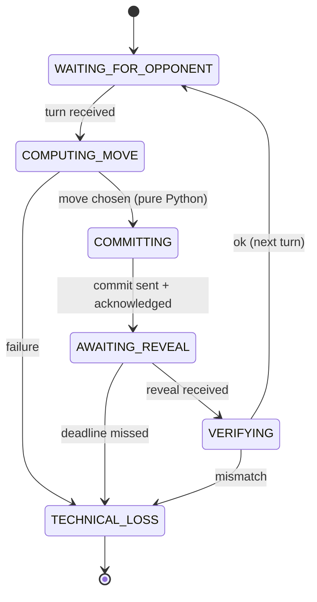
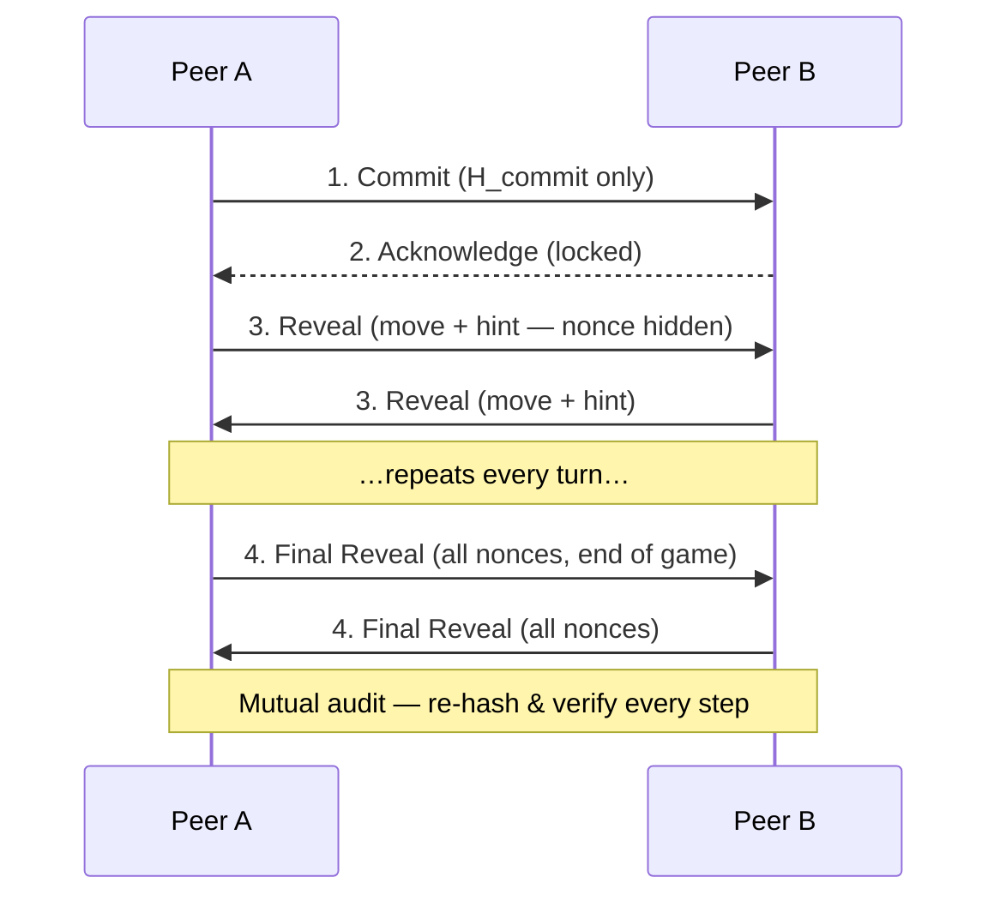

# PLAN — Architecture & Technical Design

- **Document version:** 2.11
- **Changelog:** v2.11 — compliance audit: result artifact carries all four repo links (rule 49); handshake terms explicitly lock the scent model (rule 23). v2.10 — review pass: Acknowledge step (state machine + sequence diagrams), `world` config section, threading & concurrency model, coding/testing standards, `data/` directory.
- **Status:** DRAFT — approve before development
- **Companion:** `PRD.md` (requirements), `TODO.md` (635-task WBS)

> Clean reimplementation. Architecture is ours; it follows the submission guidelines (SDK-first, ≤150-line files, gatekeeper, config-driven, ≥85% coverage) and the rulebook mechanics. Task IDs below (`T###`) point into `TODO.md`.

---

## 1. Architecture overview (C4)

### 1.1 Context (Level 1)
```
        our config only (my port + opponent URL)
[Our Agent] ⇄  public tunnel  ⇄  [Opponent Agent]   (peer, untrusted)
     │
     └── Gmail API (report)  →  Lecturer
```
No central server; each agent is a full peer (server + client). No referee — integrity is cryptographic.

### 1.2 Containers (Level 2)
```
+------------------------------------------------------+
|  Agent process (one per role, separate config dir)   |
|  GUI (Tkinter) ─┐                                    |
|  CLI ───────────┼─► SDK ─► Peer ─► Domain ─► Infra ─► network / Gmail
|  Replay viewer ─┘         (orchestrator)  (pure)    |
+------------------------------------------------------+
```

### 1.3 Components (Level 3) — layered, SDK-first
```
src/<pkg>/
├── sdk/        # single entry point (run_peer, replay)         [T490-497]
├── peer/       # PeerRuntime orchestrator + state machine      [T354-398]
├── domain/     # pure game logic (no I/O)                      [T061-110, T229-260, T343-369]
├── strategy/   # decision policies + trash-talk                [T176-228, T268-290]
├── infra/      # MCP server/client, email, LLM providers       [T141-175, T277-290, T446-459]
├── report/     # 4 JSON artifacts                              [T408-425]
├── gui/        # live view + replay viewer                     [T460-489]
├── shared/     # gatekeeper, config, rate limiter, sysinfo, version [T053-060, T370-378, T426-445]
└── constants.py# immutable enums/values                        [T061-068]
```

---

## 2. Layer responsibilities

| Layer | Responsibility | Must NOT |
|---|---|---|
| **SDK** | expose every operation | contain game logic |
| **Peer** | orchestrate one game (negotiate, turn loop, deadlines, audit) | know transport/GUI details |
| **Domain** | pure, testable rules & math | do any I/O |
| **Strategy** | choose the move (pure Python) + write the hint | let the LLM pick the move |
| **Infra** | MCP transport, email, LLM calls | hold game state |
| **Shared** | cross-cutting: config, gatekeeper, versioning, sysinfo | contain business logic |

**Rule:** GUI/CLI → SDK only. No layer reaches around the SDK.

---

## 3. Full module inventory (maps to `TODO.md`)

| Module | Layer | Responsibility | Phase | Tasks |
|---|---|---|---|---|
| `constants.py` | core | roles, directions, deltas, move types | 1 | T061-068 |
| `domain/board.py` | domain | grid geometry, legal moves, distance | 1 | T069-080 |
| `domain/own_state.py` | domain | position, visited, barriers | 1 | T081-090 |
| `domain/rules.py` | domain | capture / survival / end conditions | 1 | T091-100 |
| `domain/scoring.py` | domain | subgame + series scoring, tie | 1 | T101-110 |
| `domain/protocol.py` | domain | TurnMessage, turn token | 2 | T131-140 |
| `infra/mcp_server.py` | infra | FastMCP server + tools | 2 | T141-151 |
| `infra/mcp_client.py` | infra | call opponent, retry | 2 | T152-160 |
| `strategy/brains.py` | strategy | BrainBase, Police/Thief policies | 3 | T176-201 |
| `strategy/__init__.py` | strategy | `resolve_brain` factory | 3 | T213-219 |
| `domain/smell.py` | domain | 5×5 emission, multiplicative decay | 4 | T229-244 |
| `domain/belief.py` | domain | probability grid, Bayes, diffuse | 4 | T245-260 |
| `strategy/trash_talk.py` | strategy | template hints, verdict, word cap | 4 | T268-276 |
| `strategy/talk_providers.py` | strategy | LLM providers + fallback | 4 | T277-290 |
| `peer/handshake.py` | peer | negotiation, SHA-256 agreement | 5 | T313-326 |
| `domain/crypto.py` | domain | commit-reveal, audit | 6 | T343-353, T361-369 |
| `peer/sealing.py` | peer | seal each step, Step-0 spec | 6 | T354-360, T370-378 |
| `peer/runtime.py` | peer | orchestrator + state machine + loop | 6 | T379-398 |
| `shared/sysinfo.py` | shared | hardware declaration | 6 | T370-378 |
| `report/artifacts.py` | report | 4 JSON artifacts | 7 | T408-425 |
| `shared/gatekeeper.py` | shared | quota/bucket/DOS, queue | 7 | T426-440 |
| `shared/rate_limiter.py` | shared | token-bucket limiter | 7 | T441-445 |
| `infra/email_sender.py` | infra | Gmail OAuth send | 7 | T446-459 |
| `gui/window.py` + `board_view.py` | gui | live heatmap, banner | 7 | T460-473 |
| `gui/replay.py` + `replay_data.py` | gui | replay + hash verify | 7 | T474-489 |
| `sdk/sdk.py` + `series.py` | sdk | facade, series runner | 7 | T490-497 |
| `shared/config.py` + `version.py` | shared | config manager, versioning | 0 | T053-060 |

---

## 4. Key runtime components
- **Orchestrator (PeerRuntime):** single gateway to all subsystems; drives the state machine. [T391-392]
- **Gatekeeper:** every external call → rate-limit + FIFO queue + retry + DOS detection + logging. [T426-440]
- **Config manager:** load signed `game.json` (overlay private `game.toml`); validate version; compute `config_sha256`. [T057-060]

### 4.1 Turn state machine [T379-386]
Commit is followed by the opponent's **Acknowledge** before any reveal (rulebook Fig. 6).



### 4.2 Commit-reveal protocol sequence (per rulebook Fig. 6)


---

## 5. Data contracts

### 5.1 Config split
- **`config/<role>/game.json`** — SHARED, signed, byte-identical, per Appendix F. Sections: `board_and_agents`, `world` (`map_area`, `hint_max_words`), `movement_and_barriers`, `scoring`, `pheromones`, `network_and_league` (official series: `num_games = 6`), `rate_limiter_gatekeeper`.
- **`config/<role>/game.toml`** — PRIVATE (port, opponent URL, identity, strategy classes, trash_talk, LLM, email, belief tuning). JSON overrides TOML.

### 5.2 Commit payload
`{step, state, position, move, intent, hint, prompt_discussion, tokens, response_seconds, nonce}` → `commit = SHA256(canonical_json | nonce)`; canonical = `json.dumps(sort_keys=True, separators=(",",":"))`.

### 5.3 The 4 JSON artifacts
| File | Content |
|---|---|
| `declaration_<game_id>.json` | identities, repos, MCP URLs, hardware, token budget, times |
| `config_<game_id>_g<NN>.json` | agreed config + `config_sha256` |
| `log_<game_id>_g<NN>.json` | sealed records + summary + audit |
| `result_<game_id>.json` | per-subgame scores + aggregate + mutual-agreement signature + **all 4 repo links (2 per team, rule 49)** + commit ids + total tokens |

---

## 6. Cross-cutting concerns
- **Security:** OAuth `gmail.send` only; secrets via env; `.gitignore` excludes `token.json,credentials.json,.env,*.key,*.pem`. [T446-459, T503]
- **Versioning:** `shared/version.py` starts 1.00; `"version"` keys in every JSON; runtime validation. [T058, T586]
- **Reliability:** deadline on every request (30s); watchdog (60s) → controlled shutdown + persist. [T387-398]
- **Language rule:** the hint channel carries **natural language only** — no coordinate/numeric location protocols (Appendix E rules 26–27); outbound hints are validated before send. [T623-624]

### 6.1 Threading & concurrency model [T509]
| Thread | Runs | Talks to others via |
|---|---|---|
| Main | PeerRuntime turn loop (headless) or Tkinter mainloop (GUI mode; runtime moves to a worker thread) | event queue |
| MCP server | FastMCP HTTP listener | thread-safe inbox `queue.Queue`s per message type |
| Watchdog | daemon heartbeat monitor (60s) | reads heartbeat timestamp; triggers controlled shutdown |
| Banter worker | bounded LLM call (`ThreadPoolExecutor`, deadline) | future result; timeout → template fallback |

Rules: cross-thread state moves **only through queues**; GUI widgets touched only from the GUI thread; no shared state between the two peer *processes* (Zero-Trust); locks documented where unavoidable.

### 6.2 Coding & testing standards (guidelines §3, §6, §16)
- Files **≤150 code lines**; split, never compress. Docstrings state **Input / Output / Setup** (building-block style); comments explain *why*.
- **TDD** red-green-refactor; tests mirror `src/` in `tests/unit`; every public function tested (standard path + error case); externals mocked; shared fixtures in `conftest.py`; test files ≤150 lines too.
- DRY: 2+ duplicated bodies → shared module; 3+ duplicated methods → base class/mixin (one concern per mixin).
- All execution through `uv run`; relative imports only.

---

## 7. Tech stack
Python **3.13+** · **`uv`** (pyproject + uv.lock) · **`fastmcp`** · **`ruff`** (`E,F,W,I,N,UP,B,C4,SIM`; ignore `E501`; line 100) · **`pytest` + `pytest-cov`** (`fail_under=85`) · **Tkinter** (GUI) · **Gmail API + google-auth** (OAuth2) · **ngrok/Localtonet** (tunnel).

---

## 8. Architectural Decision Records (ADRs)
- **ADR-1 Clean reimplementation** — full ownership; reference is study-only.
- **ADR-2 Move = pure Python, LLM = banter only** — LLMs hallucinate coordinates; keeps games legal/fast/free/deterministic.
- **ADR-3 Commit = `SHA256(canonical_json(payload) | nonce)`** — interoperability; any team re-verifies byte-for-byte.
- **ADR-4 Two processes + two repos (Zero-Trust)** — rulebook mandate; prevents state leakage.
- **ADR-5 Scent decay multiplicative `(1−ρ)·τ+Δτ`** — matches the book (reference engine's subtractive decay is a deviation; book wins).
- **ADR-6 SDK-first + Gatekeeper** — submission-guideline mandate.
- **ADR-7 Config split JSON (signed/shared) vs TOML (private)** — only opponent-relevant values are signed; private tuning stays local.

---

## 9. Two-repo layout
Both repos share the engine core; they differ only in default role + strategy class.
```
<repo>/  README.md  pyproject.toml  uv.lock  .gitignore  .env-example  LICENSE
  docs/{PRD,PLAN,TODO}.md + PRD_<mechanism>.md + ADR/ + PROMPTS.md
  config/{police,thief}/{game.json,game.toml,rate_limits.json}
  src/<pkg>/{sdk,peer,domain,strategy,infra,report,gui,shared}/  constants.py
  tests/{unit,integration}/  conftest.py
  notebooks/  results/  assets/  scripts/  data/
```
Cop README ↔ Thief README cross-linked; both shared with the lecturer. [T015-028, T558-564]
