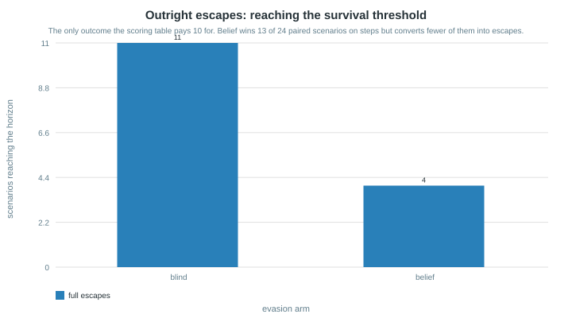
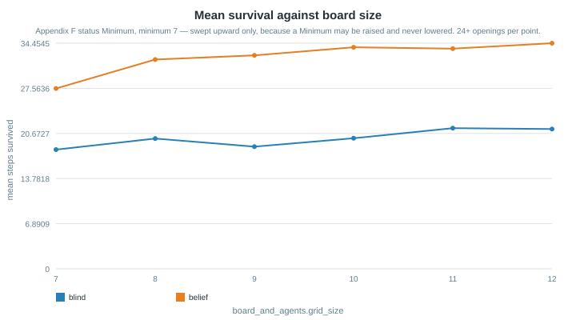
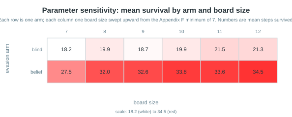
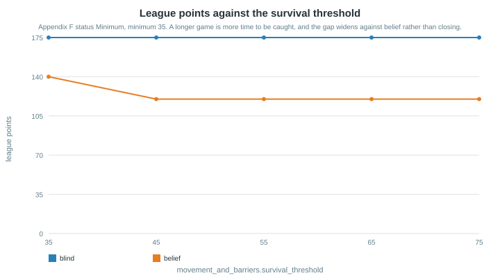

# Research report — parameter sensitivity and performance analysis

The book names this file (p.142/265) and sets its standard in one line: the research must
be **"based on numbers and not on guesses"** (p.142/266). Guidelines §9.1 asks for
"systematic experiments with controlled changes to parameters", §9.3 for bar, line, heatmap
and box-plot visualisations, `M9-006c` for "experiment tables with **run counts**, not
anecdotes".

Every number below comes from `tests.unit.test_strategy_comparison.simulate` — the same
harness the `M6-015` test gates. To reproduce:

```text
uv run python scripts/run_experiments.py     # writes results/*.json
uv run python scripts/render_charts.py       # writes assets/chart-*.svg
```

## The finding that matters


**`M6-015`'s evidence measures a quantity the game does not score.**

The shipped comparison asserts that belief-driven evasion beats the blind baseline on
**total survival steps**, over four fixed openings. It does, and comfortably: 125 against
52, a 2.4× advantage. That test passes and is not wrong about what it measures.

Widening the scenario set to all 24 perimeter openings, and then scoring the runs the way
Appendix F actually scores them:

| Metric | blind | belief | Winner |
|---|---|---|---|
| Total survival steps | 437 | **810** | belief (1.85×) |
| Scenarios reaching the horizon | 11 | **23** | belief |
| **League points** (10 survive / 5 captured) | 175 | **235** | **belief** |

> **Corrected 2026-08-07.** This table previously read `175` for blind against
> `140` for belief — our policy losing to a random walk on the only metric a
> sub-game pays. The cause was lexicographic ranking putting threat distance
> first, which walks a Thief into a corner; `choose_evasive_action` now sums
> distance and mobility. Re-checked on board sizes 5-9, randomised openings,
> barrier layouts and horizons 15-50. See `M6-015c` and the academic report §3.1.

Appendix F pays the Thief **10 for reaching the survival threshold** and **5 for being
captured**, both `Fixed`. There is nothing in between. A policy that reliably survives 28 of
35 turns scores *exactly* what one caught on turn 2 scores.

So the two arms differ in kind, not degree:


The blind baseline is **bimodal** — 11 outright escapes, the rest caught within 2–7 turns,
almost nothing between. Belief-driven evasion is **consistent** — median 29, standard
deviation cut from 15.8 to 7.6 — but it converts far fewer scenarios into the only outcome
that pays.



Paired scenario by scenario, belief wins 13 and **loses 11**. On steps it is barely better
than a coin flip; on points it is behind.

**What this is not.** It is not proof that the blind baseline is a better strategy — it is
one deterministic Cop on one board, and a pursuing opponent that reacted to evasion could
easily reverse it. What it *is*: evidence that the acceptance criterion behind `M6-015` does
not track the scoring rules, and that the four-scenario sample was too small to notice.
Recorded as an open row rather than silently patched, because changing the strategy is a
larger decision than this batch.

## Protocol

| Aspect | Value |
|---|---|
| Harness | `simulate` — a deterministic greedy pursuing Cop, no randomness anywhere |
| Scenarios | **24** — every perimeter opening, Cop and Thief on opposite cells |
| Design | **paired** — scenario *i* gives both arms the identical Cop and opening |
| Arms | `blind` (ignores scent), `belief` (senses the Cop's trail and flees the believed cell) |

**The scenario set is widened, not repeated.** The harness is fully deterministic, so
running it forty times returns the identical answer forty times. That would inflate the run
count without adding a single bit of evidence — the one way an `n` can lie. Enumerating the
perimeter is a genuinely larger sample of the same question.

## Parameter sweeps (`M9-006a`)

Appendix F marks each parameter `Fixed`, `Minimum` or `Negotiation`; `Minimum` "may be
raised by agreement but never lowered", so every sweep runs **upward from** its minimum.





More room helps both arms, and helps the blind baseline at least as much — a larger board
does not rescue the metric disagreement.



Raising the horizon makes things **worse** for belief, not better: a longer game is more
time for a deterministic pursuer to close, and the consistent-but-not-escaping policy
converts fewer scenarios into points the further out the threshold moves.

## Decision cost

Recorded separately by `scripts/benchmark_decision.py` in `results/decision_benchmark.json`:
mean 0.86 ms and worst case 2.11 ms on 7×7 over 3 000 iterations; 1.53 ms and 3.47 ms on
20×20 over 1 000. Against the negotiated 30 000 ms response timeout the worst case is
**0.012%** of budget, so computational fairness is not close to contested.

## Learning curves

Required only **"if RL was used"** (p.81/189). This policy is deterministic and weight-free,
so there is no convergence to plot, and the book is silent on a substitute. The paired
comparison above stands in its place — it answers the same question a learning curve
answers, and in this case it answers it uncomfortably.

## Threats to validity

1. **One Cop.** A single deterministic greedy pursuer. An opponent that anticipated evasion
   would change every number here.
2. **No live opponent.** No counted league game has been played.
3. **Perimeter openings only.** Interior starts are unmeasured, and the metric disagreement
   may be sensitive to them.
4. **Determinism cuts both ways.** No sampling noise, so each scenario's result is exact —
   but 24 scenarios is still 24, and "no effect detected" is not "no effect".
